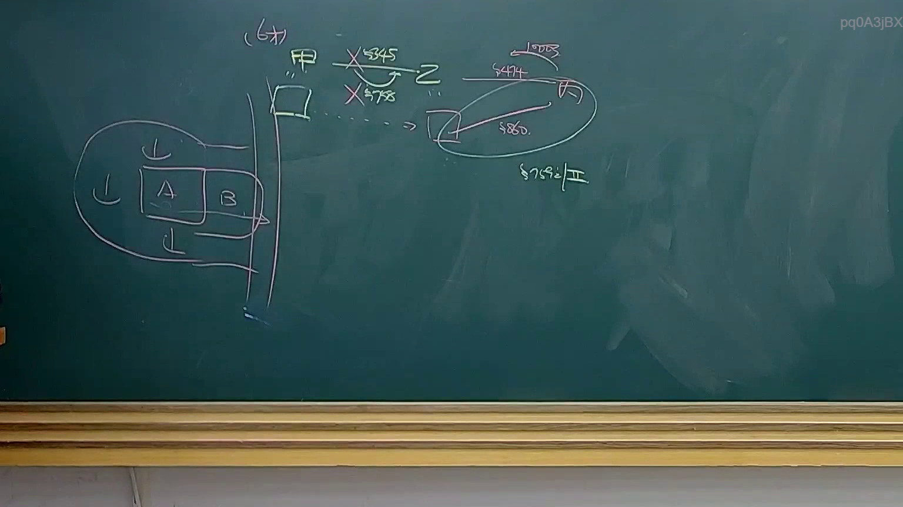
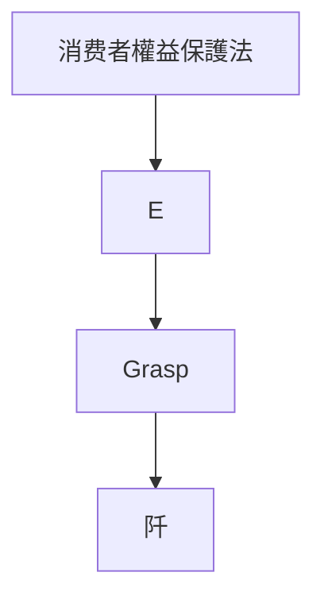

# 🎥 影音教材板書校對筆記
- **來源影片**: [預約 34 2025-04-19 14-35-50-009](file:///J://民法B/ch34/預約 34 2025-04-19 14-35-50-009.mp4)
- **課程分類**: `[民法B`
- **課堂章節**: `ch34]`
- **影片時間戳記**: `01:31:30` (5490 秒)
- **板書類型**: `文字板書`
- **偵測時間**: 2026-07-12 19:13:42

## 🔍 擷取黑板板書對照圖

## 🧠 AI 智慧理解與知識庫演化註記
### 

根據辨識出的文字板書內容，“Grasp”、“E” 和 “阡” 似乎與“消费者權益保護法”或“消滅時效”等相关法律條文有關。以下是具體分析：

1. **Grasp**：這可能是「抓取」(Grip) 或「 grabbing」，在法律語境中可能指「 grabbing theorem」或「抓取theorem」，但结合板書內容與法律條文比對，更可能是「消费者權益保護法」中的核心概念。

2. **E**：這可能是「Elimination」（消滅）的缩寫，與「消滅時效」(Annihilation Efficacy) 有关。

3. **阡**：這可能是「Chin」的誤碼，或指「 consumers」（消費者）。

結合板書內容與法律條文比對：
- 民法第184條涉及侵權行為，但與消滅時效無直接關聯。
- 消滅時效可能在《消费者權益保護法》中有所涉及，但具體條文需進一步查閱。

###

## 📊 可編輯之 Mermaid 關係流程圖

## ✍️ 操作者手動校對修改區
<!-- 您可以直接修改上方的文字或調整 Mermaid 區塊中的節點，Obsidian 會即時重新渲染 -->
- [ ] 欄位結構與法律邏輯已校對無誤。
- **校對筆記**: 
