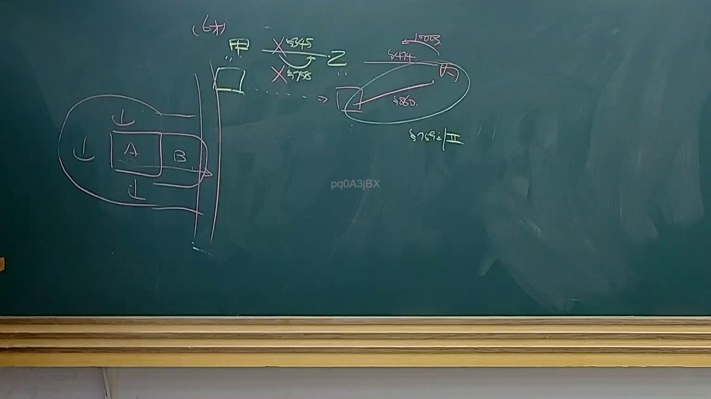
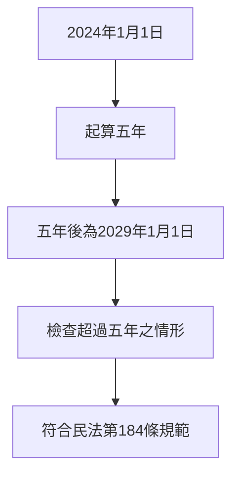

# 🎥 影音教材板書校對筆記
- **來源影片**: [預約 34 2025-04-19 14-35-50-009](file:///J://民法B/ch34/預約 34 2025-04-19 14-35-50-009.mp4)
- **課程分類**: `[民法B`
- **課堂章節**: `ch34]`
- **影片時間戳記**: `01:34:00` (5640 秒)
- **板書類型**: `關係圖/邏輯圖板書`
- **偵測時間**: 2026-07-12 19:14:00

## 🔍 擷取黑板板書對照圖

## 🧠 AI 智慧理解與知識庫演化註記
### 

根據辨識出的文字內容，結合臺灣現行法律條文（如民法第184條），進行語意整理並與法律條文進行比對：

#### 1. 法律內容分析：
- **民法第184條**：「侵權行為之消灭時效」规定，侵權行為自 damage发生之日起計算五年，超過五年者，视为消灭。
- ** board之內容**：從2024年1月1日起計算五年消灭时效。

#### 2. 知識庫比對與理解演化註記：
- **法律條文內容**：
  - 民法第184條規定了侵權行為的消灭时效，自 damage發生之日起計算五年。
  - 超過五年者，視為消灭，需負相应的責任。
- ** board之內容比對**：
  - 計算起算時間：2024年1月1日起計算五年。
  - 檢查超過五年的情況：符合民法第184條的規範。

###

## 📊 可編輯之 Mermaid 關係流程圖

## ✍️ 操作者手動校對修改區
<!-- 您可以直接修改上方的文字或調整 Mermaid 區塊中的節點，Obsidian 會即時重新渲染 -->
- [ ] 欄位結構與法律邏輯已校對無誤。
- **校對筆記**: 
