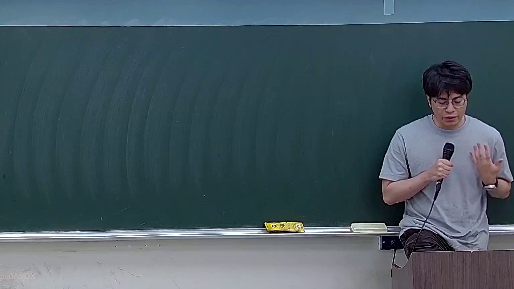
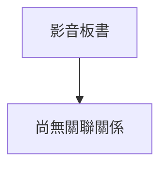

# 🎥 影音教材板書校對筆記
- **來源影片**: [預約 34 2026-05-23 22-12-23-022](file:///J://刑法B115/ch34/預約 34 2026-05-23 22-12-23-022.mp4)
- **課程分類**: `[刑法B115`
- **課堂章節**: `ch34]`
- **影片時間戳記**: `01:16:45` (4605 秒)
- **板書類型**: `關係圖/邏輯圖板書`
- **偵測時間**: 2026-07-13 07:45:03

## 🔍 擷取黑板板書對照圖

## 🧠 AI 智慧理解與知識庫演化註記
：

您好！您的訊息中「擷取區域的 OCR 辨識字元如下」之後，實際的文字內容似乎為空白或未成功貼上。我無法看到任何可辨識的字元來進行語意整理與法律條文比對。

請您重新提供以下任一方式之一：
1. **直接貼上 OCR 辨識出的文字**（例如：「甲請求乙...」等）
2. **描述黑板上的圖畫結構**（例如：左側寫了什麼、箭頭指向哪裡、有哪些方塊/圓圈等）

一旦收到內容，我將立即為您完成：
- 📖 語意整理與臺灣現行法律條文比對（民法第184條侵權行為、消滅時效、契約關係等）
- 🔄 Mermaid.js 流程圖代碼生成（含雙引號節點格式）

期待您的補充！

## 📊 可編輯之 Mermaid 關係流程圖

## ✍️ 操作者手動校對修改區
<!-- 您可以直接修改上方的文字或調整 Mermaid 區塊中的節點，Obsidian 會即時重新渲染 -->
- [ ] 欄位結構與法律邏輯已校對無誤。
- **校對筆記**: 
