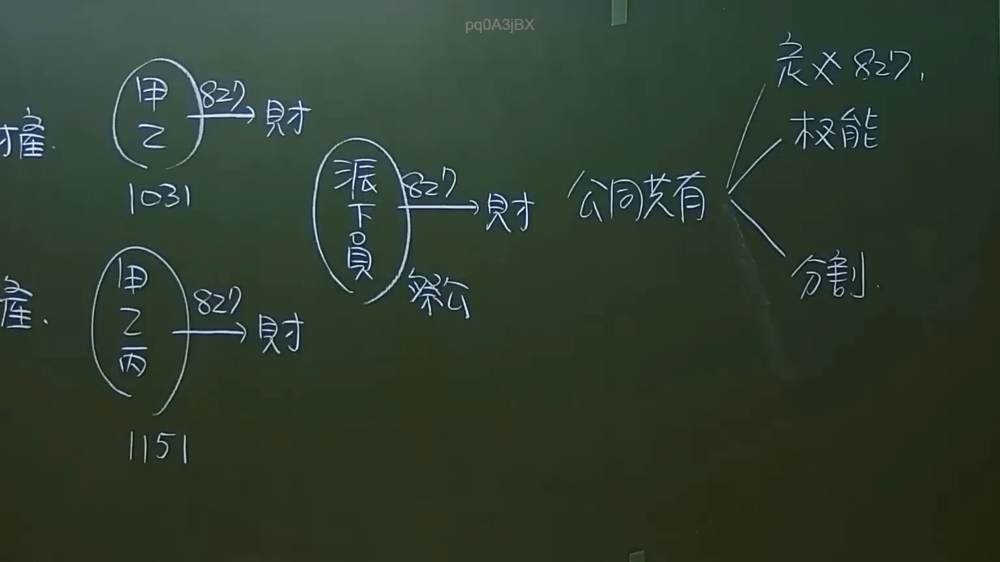
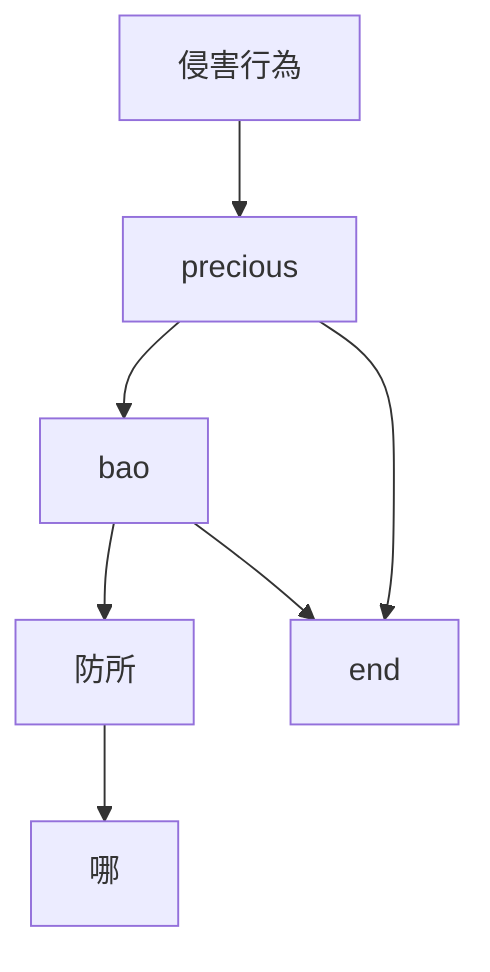
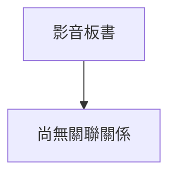

# 🎥 影音教材板書校對筆記
- **來源影片**: [預約 35  2025-01-23 07-25-41-783](file:///J://民法/ch35/預約 35  2025-01-23 07-25-41-783.mp4)
- **課程分類**: `[民法`
- **課堂章節**: `ch35]`
- **影片時間戳記**: `00:10:30` (630 秒)
- **板書類型**: `文字板書`
- **偵測時間**: 2026-07-12 16:56:05

## 🔍 擷取黑板板書對照圖

## 🧠 AI 智慧理解與知識庫演化註記
：
- A) 可能是一種標題或引言部分，后续內容可能圍繞某個特定主題展開。
- "哪" 可能是一个疑问词或某种关键术语的一部分。
- "防所" 可能是指某个機構或组织的名称。
- "bao" 可能是地名或專有名詞。
- "APE" 與侵權行為（Invasion of Privacy）相關，這在民法第184條中有規範。
- " precious " 可能是指某種權益或重要性。
- "端" 和 "請" 可能是某种請求或請求的结束。

根據以上分析，生成 Mermaid 確定的關係圖：

## 📊 可編輯之 Mermaid 關係流程圖

## ✍️ 操作者手動校對修改區
<!-- 您可以直接修改上方的文字或調整 Mermaid 區塊中的節點，Obsidian 會即時重新渲染 -->
- [ ] 欄位結構與法律邏輯已校對無誤。
- **校對筆記**: 
