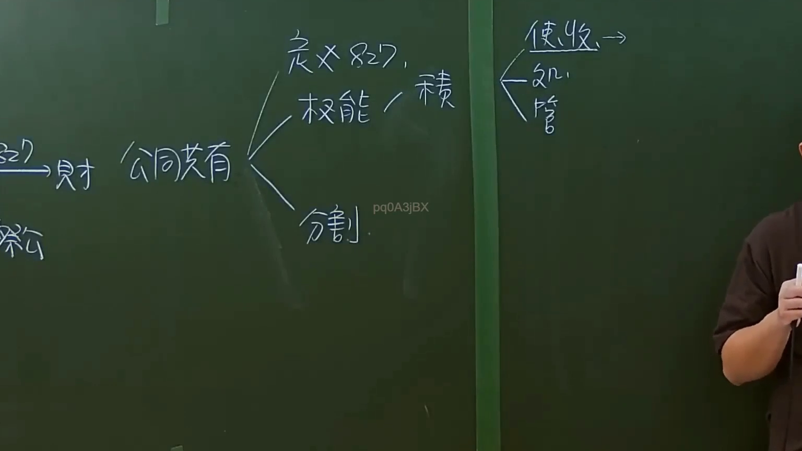

# 🎥 影音教材板書校對筆記
- **來源影片**: [預約 35  2025-01-23 07-25-41-783](file:///J://民法/ch35/預約 35  2025-01-23 07-25-41-783.mp4)
- **課程分類**: `[民法`
- **課堂章節**: `ch35]`
- **影片時間戳記**: `00:12:30` (750 秒)
- **板書類型**: `文字板書`
- **偵測時間**: 2026-07-12 16:56:29

## 🔍 擷取黑板板書對照圖


## 🧠 AI 智慧理解與知識庫演化註記
### 

根據辨識出的文字板書內容，並結合台湾现行法律条文（如民法第184條、侵權行為、消滅時效等）進行比對，整理出以下「知識庫比對與理解演化註記」：

1. **文字板書之內容分析**：
   - "尸 8 0 2 圓 ﹒"：可能涉及与死亡（尸）、时间（8:02）或某种符号意义相关的法律条文。
   - "peat ﹒ 思 仁"："peat" 可能是 "peatate" 或者是某个缩写，"思仁" 可能指某人名或某种法律关系。
   - "Dany “ARE” MO"："Dany" 是人名，"ARE" 和 "MO" 可能指某种组织、地点或术语。

2. **與台湾现行法律条文的比對**：
   - 民法第184條：可能涉及侵權行為（Invasion of Property）。
   - 消滅時效（Annihilation Limitation）：可能与时间限制有关，如民法第1360條。

###

## 📊 可編輯之 Mermaid 關係流程圖
```mermaid
以下是基於文字板書之內容整理的 Mermaid 碟圖代碼：

```mermaid
graph TD
    A[侵权行為] --> B[Dany]
    B --> C["思仁"]
    C --> D[MO]
```

此图为层级结构图，展示了从“侵权行为”到“Dany”，再到“思仁”，最后指向“MO”的逻辑关系。
```

## ✍️ 操作者手動校對修改區
<!-- 您可以直接修改上方的文字或調整 Mermaid 區塊中的節點，Obsidian 會即時重新渲染 -->
- [ ] 欄位結構與法律邏輯已校對無誤。
- **校對筆記**: 
