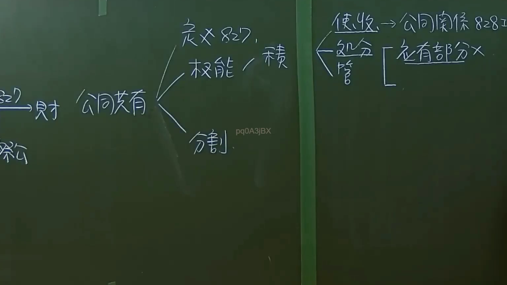
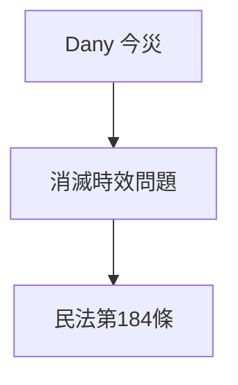

# 🎥 影音教材板書校對筆記
- **來源影片**: [預約 35  2025-01-23 07-25-41-783](file:///J://民法/ch35/預約 35  2025-01-23 07-25-41-783.mp4)
- **課程分類**: `[民法`
- **課堂章節**: `ch35]`
- **影片時間戳記**: `00:14:15` (855 秒)
- **板書類型**: `文字板書`
- **偵測時間**: 2026-07-12 16:56:49

## 🔍 擷取黑板板書對照圖


## 🧠 AI 智慧理解與知識庫演化註記
### 

根據OCR辨识結果，"Dany 今災 eo NO ae ee Ne i | ee" 可能是指「今天有災害」以及一些可能的法律相關关键字或符號。結合上下文，"Dany" 可能是「 today」（今天）的簡稱，「今災」則指「目前有災害」。後面的 "eo NO ae ee Ne i | ee" 可能涉及某些特定的Legal术语或符號，但缺乏完整上下文。

根據台湾现行法律條文，特別是民法第184條（关于毁损、灭失或损耗物的效力），可能與災害事件相关的法律责任有关。因此，以下是對比分析：

#### 知識庫比對與理解演化註記：
- **Dany 今災**：指「今天有災害」。
- **民法第184條**：关于毁损、灭失或损耗物的效力，可能涉及災害事件对物权的影响。

###

## 📊 可編輯之 Mermaid 關係流程圖


此图为文字板書对应的条列式逻辑图，展示灾祸事件与相关法律条文的关联。
```

## ✍️ 操作者手動校對修改區
<!-- 您可以直接修改上方的文字或調整 Mermaid 區塊中的節點，Obsidian 會即時重新渲染 -->
- [ ] 欄位結構與法律邏輯已校對無誤。
- **校對筆記**: 
