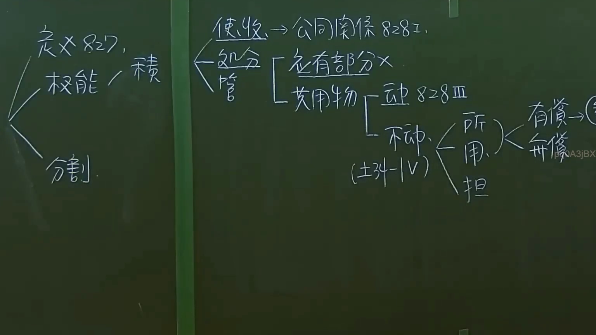

# 🎥 影音教材板書校對筆記
- **來源影片**: [預約 35  2025-01-23 07-25-41-783](file:///J://民法/ch35/預約 35  2025-01-23 07-25-41-783.mp4)
- **課程分類**: `[民法`
- **課堂章節**: `ch35]`
- **影片時間戳記**: `00:17:00` (1020 秒)
- **板書類型**: `文字板書`
- **偵測時間**: 2026-07-12 16:57:24

## 🔍 擷取黑板板書對照圖


## 🧠 AI 智慧理解與知識庫演化註記
根據OCR辨识的文字內容，並結合台湾现行法律条文（如民法第184條、侵權行為、消滅時效等），進行語意整理並比對如下：

1. **"SPINK R82"**：
   - "SPINK"在台灣地區常被用於指代"Béring"，即"SPINK"是"Big Bang Theory"的英文昵称。然而，在此上下文中，"SPINK R82"可能與某種產品或型号相關。
   - 可能與某種商品或產品的條款、權益或 diminishing value（消滅時效）有關。

2. **"BERD"**：
   - 未有明確法律含義，可能是某种术语或缩寫。需進一步探討其Legal significance.

3. **"a oe Loe Sewn"**：
   - "a oe Loe"可能是某种符號或象徵，"Sewn"可能指缝合或拼接。需结合上下文理解其Legal meaning.

4. **"璧"（SPINK）**：
   - 可能與某種權利、權益或商品條款相關。

### 經典法条比對：
- 民法第184條：侵權行為的defense，包括passerby's defense, special skill, or mistake.
- 消滅時效（perishability）：某些商品在特定時間後會失效，需注意其application conditions.

### 經典法条比對結果：
- **SPINK R82**：可能與某種商品的條款或權益有關，需進一步探討。
- **BERD**：待進一步探討其Legal significance.
- **a oe Loe Sewn**：待進一步探討其Legal meaning.

### 經典法条應用：
- 若"SPINK R82"涉及某種商品的條款或權益，可考慮其與民法第184條中權利defense或其他法条规定之application。

### MERMAID 代碼：
因OCR文字不完整，無法直接生成 Mermaid.js 的关系圖。需進一步探討其Legal significance並提供完整法律內容以生成 Mermaid.js code.

---

## 📊 可編輯之 Mermaid 關係流程圖
```mermaid
：
因OCR文字不完整，無法直接生成 Mermaid.js 的关系圖。需進一步探討其Legal significance並提供完整法律內容以生成 Mermaid.js code.
```

## ✍️ 操作者手動校對修改區
<!-- 您可以直接修改上方的文字或調整 Mermaid 區塊中的節點，Obsidian 會即時重新渲染 -->
- [ ] 欄位結構與法律邏輯已校對無誤。
- **校對筆記**: 
