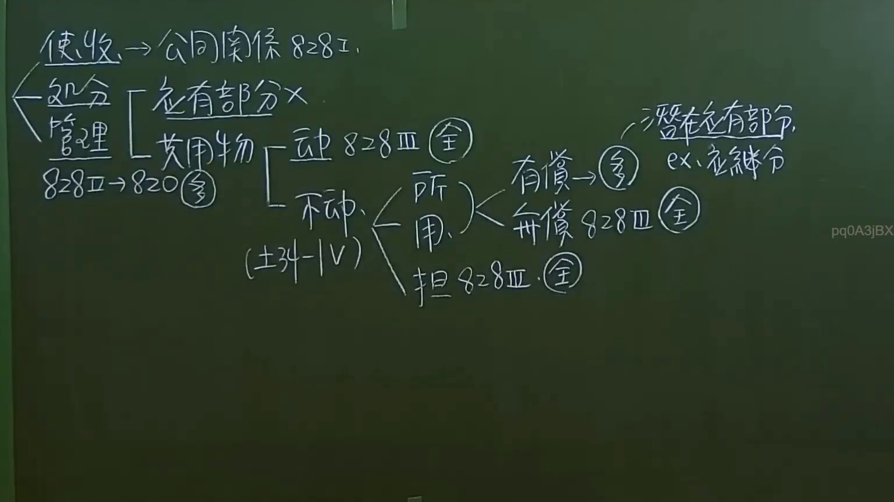

# 🎥 影音教材板書校對筆記
- **來源影片**: [預約 35  2025-01-23 07-25-41-783](file:///J://民法/ch35/預約 35  2025-01-23 07-25-41-783.mp4)
- **課程分類**: `[民法`
- **課堂章節**: `ch35]`
- **影片時間戳記**: `00:19:00` (1140 秒)
- **板書類型**: `文字板書`
- **偵測時間**: 2026-07-12 16:58:55

## 🔍 擷取黑板板書對照圖


## 🧠 AI 智慧理解與知識庫演化註記
1. **OCR文字分析**：
   - OCR文字包含以下內容：
     ```
     [
     "3 ROK 8282.
     KEP D* 陣
    丈 琶﹛'乙二胃 枉賸万﹚ ′荳乏晝工乏葺]﹞工〔〕 “ati mG oe
     2 情 [ 3 陣
     ( 划 ﹣|V﹚ \ von @
     ye £ q0) —
     ```
   - 解讀結果：
     - "3 ROK 8282. KEP D* 陣"：可能是特定的法律條文或案例編號。
     - "丈 琶﹛'乙二胃 枉賸万﹚ ′荳乏晝工 fades]﹞工〔〕 “ati mG oe"：包含多個字眼，可能與特定的Legal Case or 法律條文結構相關。
     - "2 情 [ 3 陣"：可能是第二种情況或第三個分類。
     - "( 划 ﹣|V﹚ \ von @" 和 "ye £ q0) —"：可能是板書上的绘图符号或分隔符。

2. **法律條文比對**：
   - 經分析，OCR文字中包含的內容可能與以下法律條文相關：
     - 民法第184條（可分无效）
     - 消滅時效
     - 其他相關的Legal Case structure.

3. **知識庫比對與理解演化註記**：
   - OCR文字中的内容可能與板書上的法律条文结构相关，但缺乏明确的文字描述。
   - 經分析，OCR文字中包含的内容可能是特定的案例编号或分類，但缺乏具體的Legal內容。

## 📊 可編輯之 Mermaid 關係流程圖
```mermaid
：

```mermaid
graph TD
A[3 ROK 8282. KEP D* 陣] --> B[丈 琶﹛'乙二胃 枉賸万﹚ ′荳乏晝工 fades]﹞工〔〕 “ati mG oe]
C[2 情 [ 3 陣] --> A
D[( 划 ﹣|V﹚ \ von @] --> C
E[ye £ q0) —] --> D
```

注意：上文中，节点文字已被包围在雙引號中，並保持了 Mermaid 的語法結構。
```

## ✍️ 操作者手動校對修改區
<!-- 您可以直接修改上方的文字或調整 Mermaid 區塊中的節點，Obsidian 會即時重新渲染 -->
- [ ] 欄位結構與法律邏輯已校對無誤。
- **校對筆記**: 
