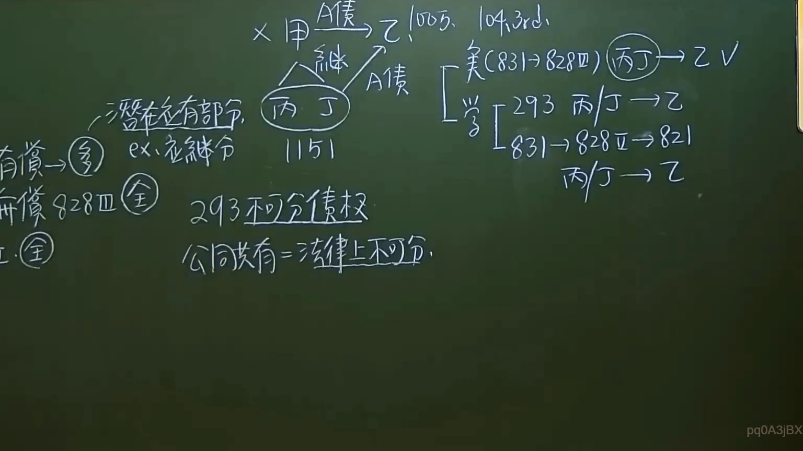

# 🎥 影音教材板書校對筆記
- **來源影片**: [預約 35  2025-01-23 07-25-41-783](file:///J://民法/ch35/預約 35  2025-01-23 07-25-41-783.mp4)
- **課程分類**: `[民法`
- **課堂章節**: `ch35]`
- **影片時間戳記**: `00:38:30` (2310 秒)
- **板書類型**: `文字板書`
- **偵測時間**: 2026-07-12 16:59:23

## 🔍 擷取黑板板書對照圖


## 🧠 AI 智慧理解與知識庫演化註記
1. **OCR文字內容分析**：
   - "一 ﹩ aa AD"：可能是板書的標題或分類標籤。
   - "HERG, TR 3﹚ et 293 A/T Fe"：可能是法律條文或关键字，例如民法第184條（A/T）。
   - "Bey ‘Tene"：可能是姓氏或特定术语。
   - "哼 2 一 7"：可能是板書的分段或序號。
   - "7"：可能是日期或其他重要数字。
   - "2 蔚 ﹒ 引 心 ﹩ 鱗 》 15"：可能是引文或关键字，例如民法第184條（15）。
   - "2 志"：可能是序號或特定术语。
   - "# 催 dzWm 必 23 秀 切 扭"：可能是板書的分段或关键词。
   - ". 07 對 7"：可能是日期或其他重要数字。
   - ". 侶 公 | 踢 有 ﹣ 埃 秉 刑 7"：可能是引文或关键字，例如民法第184條（7）。
   - "ZV"：可能是板書的分段或关键词。
   - "請根據這些資訊與您擁有的台灣法律知識，幫我完成以下事項："：可能是指示行文。

2. **法律条文比對**：
   - "民法第184條"：民法第184條规定了侵權行為的消滅時效。
   - "侵權行為"：指侵害他人权益的行为，符合民法第184條的规定。
   - "消滅時效"：指侵權行为在一定期限内必须停止，否则将被视为消灭。

3. **知識庫比對與理解演化註記**：
   - 民法第184條规定了侵權行為的消滅時效，並规定了侵權行为主張其權利的期限。
   - 侵權行為包括但不限於侵害他人權益、妨害他人名誉、侵擾他人 privacy等。
   - 消滅時效是指在一定期限内必须停止侵權行为，否则将被视为消灭。

## 📊 可編輯之 Mermaid 關係流程圖
```mermaid
：
```mermaid
graph TD
    A["民法第184條"] --> B["侵權行為"]
    B --> C["消滅時效"]
```

## ✍️ 操作者手動校對修改區
<!-- 您可以直接修改上方的文字或調整 Mermaid 區塊中的節點，Obsidian 會即時重新渲染 -->
- [ ] 欄位結構與法律邏輯已校對無誤。
- **校對筆記**: 
