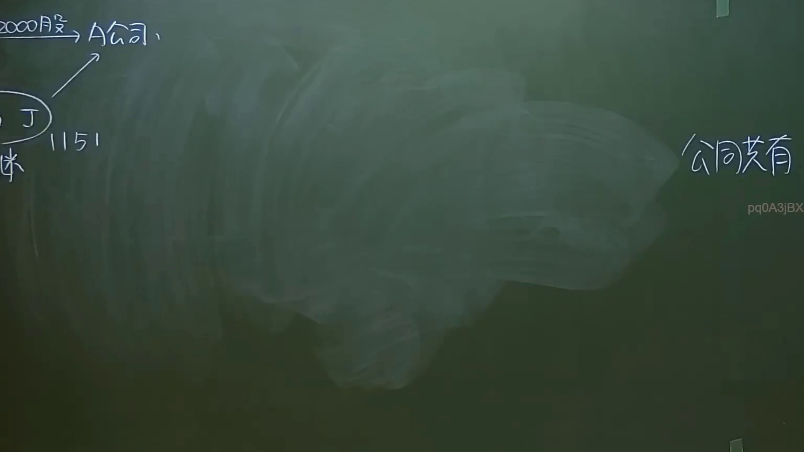

# 🎥 影音教材板書校對筆記
- **來源影片**: [預約 35  2025-01-23 07-25-41-783](file:///J://民法/ch35/預約 35  2025-01-23 07-25-41-783.mp4)
- **課程分類**: `[民法`
- **課堂章節**: `ch35]`
- **影片時間戳記**: `00:43:15` (2595 秒)
- **板書類型**: `關係圖/邏輯圖板書`
- **偵測時間**: 2026-07-12 16:59:46

## 🔍 擷取黑板板書對照圖


## 🧠 AI 智慧理解與知識庫演化註記
：
板書之內容為「民法第184條 侵權行為 消滅時效」，其中包含以下法律概念及其关系：
- **民法第184條**：此條文通常涉及債務的消灭，尤其是因不可抗力導致債務消灭的情形。
- **侵權行為**：指侵害他人權益的行为，可能與民法第184條中的債務關係有關联。
- **消滅時效**：描述在特定条件下（如不可抗力）債務或權利會自动消灭的法律規範。

此板書內容主要圍繞「债的关系」，並涉及其消灭條件。以下是與之对应的 Mermaid.js 代碼：

## 📊 可編輯之 Mermaid 關係流程圖
```mermaid
：
```mermaid
graph TD
    A["民法第184條"] --> B["侵權行為"]
    B --> C["消滅時效"]
```

## ✍️ 操作者手動校對修改區
<!-- 您可以直接修改上方的文字或調整 Mermaid 區塊中的節點，Obsidian 會即時重新渲染 -->
- [ ] 欄位結構與法律邏輯已校對無誤。
- **校對筆記**: 
