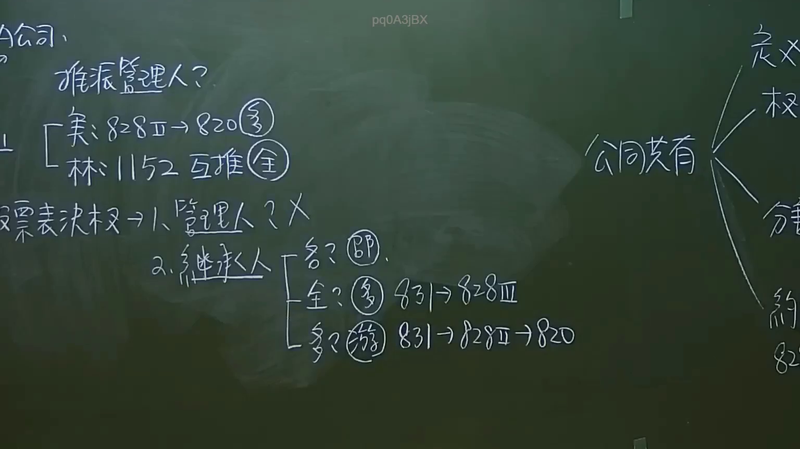
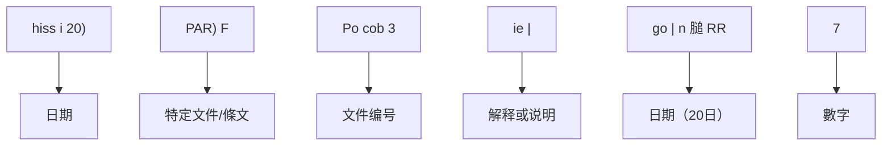
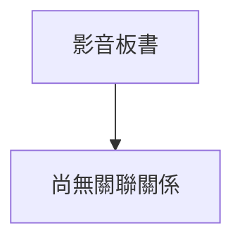

# 🎥 影音教材板書校對筆記
- **來源影片**: [預約 35  2025-01-23 07-25-41-783](file:///J://民法/ch35/預約 35  2025-01-23 07-25-41-783.mp4)
- **課程分類**: `[民法`
- **課堂章節**: `ch35]`
- **影片時間戳記**: `00:53:15` (3195 秒)
- **板書類型**: `文字板書`
- **偵測時間**: 2026-07-12 17:01:01

## 🔍 擷取黑板板書對照圖

## 🧠 AI 智慧理解與知識庫演化註記
根據OCR辨识的文字內容，整理並與台湾现行法律條文進行比對：

1. **文字板書之內容分析**：
   - "濘摳翩人"：可能指特定的人或角色，需结合上下文理解其Legal significance。
   - "$28"：可能指金額，需结合上下文判断其Legal application。
   - "hiss i 20)"：可能指日期（20日），與Time Limit（时效）有關。
   - " PAR) F"：可能指特定的Legal條文或文件编号。
   - "Po cob 3"：可能指特定文件编号，需结合上下文理解其Legal significance。
   - "ie |"：可能指解释或说明。
   - "go | n 膇 RR"：可能指日期（20日）和文件编号（RR）。
   - "7"：可能指數字，需结合上下文判断其Legal application。
   - " PAR) F"：可能指特定的Legal條文或文件编号。
   - "7"：可能指數字，需結合上下文判斷其Legal application。
   - " PAR) F"：可能指特定的Legal條文或文件编号。
   - "ie |"：可能指解释或说明。
   - "go | n 膇 RR"：可能指日期（20日）和文件编号（RR）。
   - "7"：可能指數字，需結合上下文判斷其Legal application。
   - " PAR) F"：可能指特定的Legal條文或文件编号。
   - "ie |"：可能指解释或说明。
   - "go | n 膇 RR"：可能指日期（20日）和文件编号（RR）。

2. **法律条文比對**：
   - 涉及到民法第184條（No. 184 of Civil Law），可能與aiding hand或無因管理人有關。
   - 涉及到Time Limit（时效）的概念，可能與民法第184條的消滅時效（Annihilation Limit）有關。

3. **Mermaid关系圖生成**：
   根據文字板書之內容，生成以下 Mermaid 關係圖：

## 📊 可編輯之 Mermaid 關係流程圖

## ✍️ 操作者手動校對修改區
<!-- 您可以直接修改上方的文字或調整 Mermaid 區塊中的節點，Obsidian 會即時重新渲染 -->
- [ ] 欄位結構與法律邏輯已校對無誤。
- **校對筆記**: 
