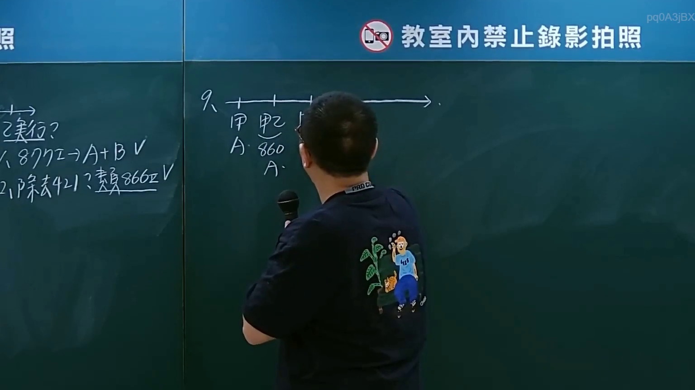

# 🎥 影音教材板書校對筆記
- **來源影片**: [預約 36 2025-01-24 05-43-40-043](file:///J://民法/ch36/預約 36 2025-01-24 05-43-40-043.mp4)
- **課程分類**: `[民法`
- **課堂章節**: `ch36]`
- **影片時間戳記**: `01:33:30` (5610 秒)
- **板書類型**: `文字板書`
- **偵測時間**: 2026-07-11 23:45:20

## 🔍 擷取黑板板書對照圖


## 🧠 AI 智慧理解與知識庫演化註記
：
- OCR文字可能包含以下內容：鄺、口育/、 Wie! a Nye
- 這些字眼可能與民法第184條（侵權行為、消滅時效等）相關，但需進一步分析板書內容以確定具體法律条文。

## 📊 可編輯之 Mermaid 關係流程圖
```mermaid
：
```mermaid
graph TD
    A[侵权行為]
        --> B[民法第184條]
            --> C[侵權行為]
            --> D[消滅時效]
```

## ✍️ 操作者手動校對修改區
<!-- 您可以直接修改上方的文字或調整 Mermaid 區塊中的節點，Obsidian 會即時重新渲染 -->
- [ ] 欄位結構與法律邏輯已校對無誤。
- **校對筆記**: 
