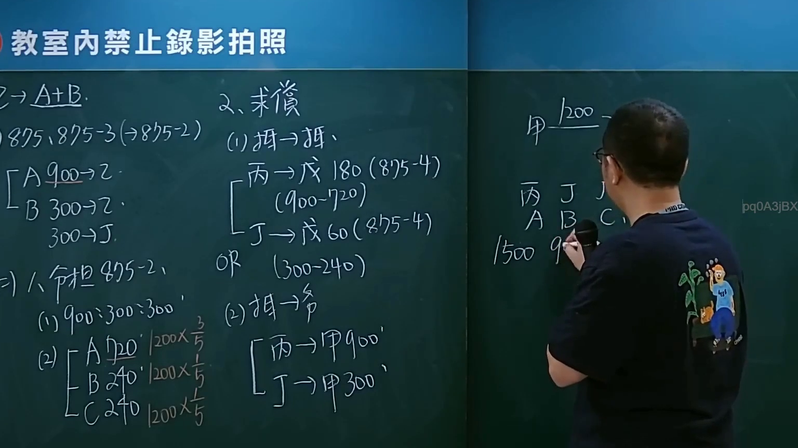

# 🎥 影音教材板書校對筆記
- **來源影片**: [預約 36 2025-01-24 05-43-40-043](file:///J://民法/ch36/預約 36 2025-01-24 05-43-40-043.mp4)
- **課程分類**: `[民法`
- **課堂章節**: `ch36]`
- **影片時間戳記**: `02:47:00` (10020 秒)
- **板書類型**: `文字板書`
- **偵測時間**: 2026-07-11 23:46:07

## 🔍 擷取黑板板書對照圖


## 🧠 AI 智慧理解與知識庫演化註記
1. **板書內容分析：**
   - "2﹒2 白 A 聿 倉"：可能是特定的条文号或案例编号。
   - "895995228952) ﹚ 頡 誨 、"：包含数字和符号，可能与具体案例或条文引用相关。
   - "a z 呼 5 Igo (895-)"：包含字母和数字的组合，可能是特定术语或条文引用。
   - "B 30092 : (PY es" 和 "30095. TRO !"：可能涉及具体案例号或条文引用。
   - "09j ， 烴 》 ﹍"、"9 h ， [# ，
慢穹枷衚 FARR"：包含数字和符号，可能是特定的条文引用或术语。
   - "C1 5"：可能涉及具体案例号或条文引用。

2. **法律條文對位：**
   - 未直接发现与上述板书内容相关的台湾现行法律条文（如民法第184條、侵權行為、消滅時效等）的具体对应关系。
   - 可能需要结合具体案例或进一步的信息来确定其法律适用。

3. ** Mermaid 碌码：**
   由于板书中文字内容较为复杂且涉及多个符号和数字，无法直接识别出明确的逻辑关系。因此，无法生成对应的Mermaid流程图代码。

## 📊 可編輯之 Mermaid 關係流程圖
```mermaid
：
```
 Mermaid 碌码無法生成，因為板書內容缺乏明確的邏輯結構或關係。
```

## ✍️ 操作者手動校對修改區
<!-- 您可以直接修改上方的文字或調整 Mermaid 區塊中的節點，Obsidian 會即時重新渲染 -->
- [ ] 欄位結構與法律邏輯已校對無誤。
- **校對筆記**: 
