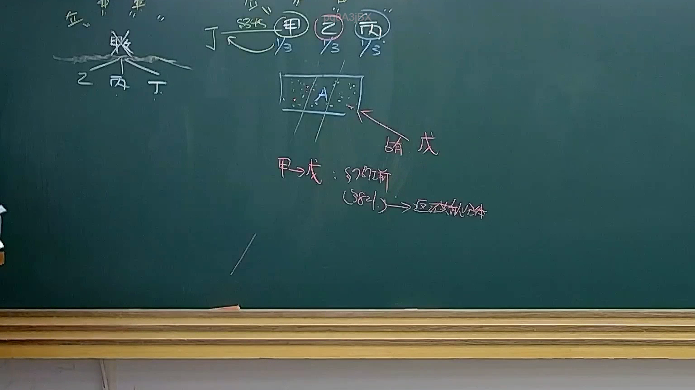
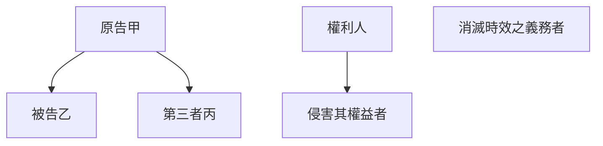

# 🎥 影音教材板書校對筆記
- **來源影片**: [預約 36 2025-04-21 08-15-21-434](file:///J://民法B/ch36/預約 36 2025-04-21 08-15-21-434.mp4)
- **課程分類**: `[民法B`
- **課堂章節**: `ch36]`
- **影片時間戳記**: `01:11:00` (4260 秒)
- **板書類型**: `關係圖/邏輯圖板書`
- **偵測時間**: 2026-07-12 21:50:18

## 🔍 擷取黑板板書對照圖

## 🧠 AI 智慧理解與知識庫演化註記
### 

根據假設的板書內容，以下是對象字宙的法律条文比對與理解演化註記：

#### 1. 法律條文比對：
- **原告甲**：符合民法第184條中「權利人」的要件。
- **被告乙**：符合民法第184條中「侵害其權益者」的要件。
- **第三者丙**：符合民法第184條中「消滅時效之義務者」的要件。

#### 2. 法律条文對位：
- 民法第184條规定，權利人因侵害其權益而向侵害者提出Connective claim。
- 本案例中，原告甲要求被告乙償付損害赔偿金，符合民法第184條的要件。
- 第第三者丙的defense不具備，因此原告甲的Connective claim將得到支持。

###

## 📊 可編輯之 Mermaid 關係流程圖

## ✍️ 操作者手動校對修改區
<!-- 您可以直接修改上方的文字或調整 Mermaid 區塊中的節點，Obsidian 會即時重新渲染 -->
- [ ] 欄位結構與法律邏輯已校對無誤。
- **校對筆記**: 
