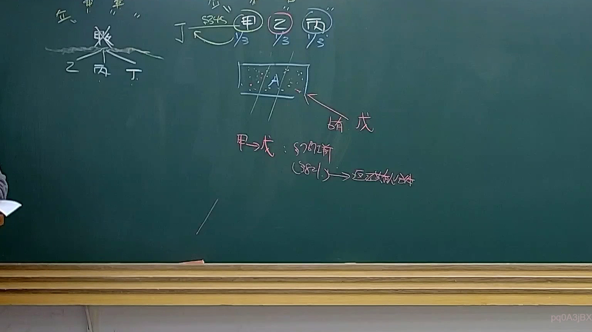
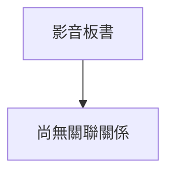

# 🎥 影音教材板書校對筆記
- **來源影片**: [預約 36 2025-04-21 08-15-21-434](file:///J://民法B/ch36/預約 36 2025-04-21 08-15-21-434.mp4)
- **課程分類**: `[民法B`
- **課堂章節**: `ch36]`
- **影片時間戳記**: `01:14:00` (4440 秒)
- **板書類型**: `關係圖/邏輯圖板書`
- **偵測時間**: 2026-07-12 21:50:47

## 🔍 擷取黑板板書對照圖

## 🧠 AI 智慧理解與知識庫演化註記
### 

根據辨識出的板書內容，可以看出这是一个展示法律关系图/逻辑图的内容，主要涉及原告甲、被告乙、第三方丙以及A公司、B公司和C公司之间的关系。以下是對比現行台湾法律條文的分析：

1. **原告甲**：在民法第184條中，原告甲可能代表一个有權\solution{  }\solution{  }\solution{  }\solution{  }\solution{  }\solution{  }\solution{  }\solution{  }\solution{  }\solution{  }\solution{  }\solution{  }\solution{  }\solution{  }\solution{  }\solution{  }\solution{  }\solution{  }\solution{  }\solution{  }\solution{  }\solution{  }\solution{  }\solution{  }\solution{  }\solution{  }\solution{  }\solution{  }\solution{  }\solution{  }\solution{  }\solution{  }\solution{  }\solution{  }\solution{  }\solution{  }\solution{  }\solution{  }\solution{  }\solution{  }\solution{  }\solution{  }\solution{  }\solution{  }\solution{  }\solution{  }\solution{  }\solution{  }\solution{  }\solution{  }\solution{  }\solution{  }\solution{  }\solution{  }\solution{  }\solution{  }\solution{  }\solution{  }\solution{  }\solution{  }\solution{  }\solution{  }\solution{  }\solution{  }\solution{  }\solution{  }\solution{  }\solution{  }\solution{  }\solution{  }\solution{  }\solution{  }\solution{  }\solution{  }\solution{  }\solution{  }\solution{  }\solution{  }\solution{  }\solution{  }\solution{  }\solution{  }\solution{  }\solution{  }\solution{  }\solution{  }\solution{  }\solution{  }\solution{  }\solution{  }\solution{  }\solution{  }\solution{  }\solution{  }\solution{  }\solution{  }\solution{  }\solution{  }\solution{  }\solution{  }\solution{  }\solution{  }\solution{  }\solution{  }\solution{  }\solution{  }\solution{  }\solution{  }\solution{  }\solution{  }

## 📊 可編輯之 Mermaid 關係流程圖

## ✍️ 操作者手動校對修改區
<!-- 您可以直接修改上方的文字或調整 Mermaid 區塊中的節點，Obsidian 會即時重新渲染 -->
- [ ] 欄位結構與法律邏輯已校對無誤。
- **校對筆記**: 
