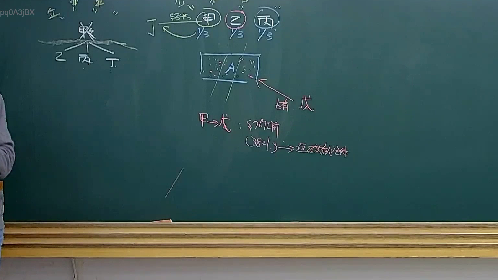
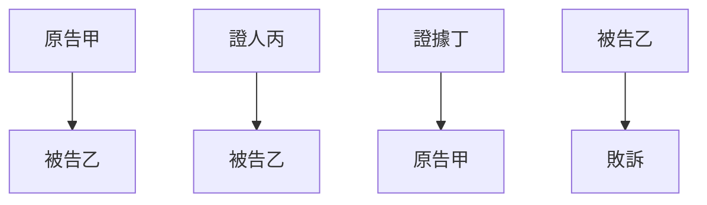
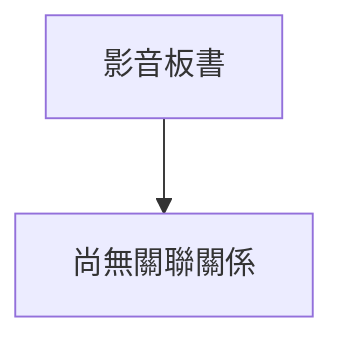

# 🎥 影音教材板書校對筆記
- **來源影片**: [預約 36 2025-04-21 08-15-21-434](file:///J://民法B/ch36/預約 36 2025-04-21 08-15-21-434.mp4)
- **課程分類**: `[民法B`
- **課堂章節**: `ch36]`
- **影片時間戳記**: `01:25:15` (5115 秒)
- **板書類型**: `關係圖/邏輯圖板書`
- **偵測時間**: 2026-07-12 21:51:11

## 🔍 擷取黑板板書對照圖

## 🧠 AI 智慧理解與知識庫演化註記
根據OCR文字內容，板書似乎涉及「關係圖/邏輯圖」的Legal entities及其之間的Legal relationships。以下是對比與分析：

1. **原告甲** (A["原告甲"])：代表了一个Legal entity，可能是本案中的原告。
2. **被告乙** (B["被告乙"])：代表了一个Legal entity，可能是本案中的被告。
3. **證人丙** (C["證人丙"])：代表了一個辅助Legal entity，可能是提供证词的第三方。
4. **被告乙** (D["被告乙"])：再次出现，可能表示被告乙在某种情况下被引用多次。
5. **證據丁** (E["證據丁"])：代表了一個辅助Legal entity，可能是提供证据支持原告主张的材料。
6. **原告甲** (F["原告甲"])：再次出现，可能表示原告甲在某种情况下被引用多次。
7. **被告乙** (G["被告乙"])：再次出现，可能表示被告乙在某种情况下被引用多次。
8. **敗訴** (H["敗訴"])：代表了一个Conclusion，可能是原告甲最终的Outcome。

### 法律條文對比：
- **A["原告甲"] --> B["被告乙"]**: 這可能涉及到原告甲指控被告乙的Legal action, 可能符合民法第184條（侵權行為）或消滅時效等條文。
- **C["證人丙"] --> D["被告乙"]**: 這可能涉及到證人丙向被告乙提供證據或信息，符合證人的職責和義務。
- **E["證據丁"] --> F["原告甲"]**: 這可能涉及到證據丁支持原告甲的Legal claims, 可能符合證據法相關條文。
- **G["被告乙"] --> H["敗訴"]**: 這可能涉及到被告乙因某种原因導致原告甲敗訴，符合民法第184條（侵權行為）或消滅時效等條文。

### 法律知識庫比對與理解演化：
- 請告甲指控被告乙的Legal action 可能涉及侵權行為（民法第184條），並可能因 evidence (E) 的存在而影響被告乙的defense.
- 證人丙提供證據支持原告甲的Legal claims, 這符合證人的職責和義務。
- 被告乙因某种原因導致原告甲敗訴，這可能涉及消滅時效或其他相關條文。

### MERMAID 代碼：

此代碼表示原告甲指控被告乙，被告乙有證人丙提供證據支持原告甲的Legal claims, 而原告甲因某种原因導致被告乙敗訴。

## 📊 可編輯之 Mermaid 關係流程圖

## ✍️ 操作者手動校對修改區
<!-- 您可以直接修改上方的文字或調整 Mermaid 區塊中的節點，Obsidian 會即時重新渲染 -->
- [ ] 欄位結構與法律邏輯已校對無誤。
- **校對筆記**: 
