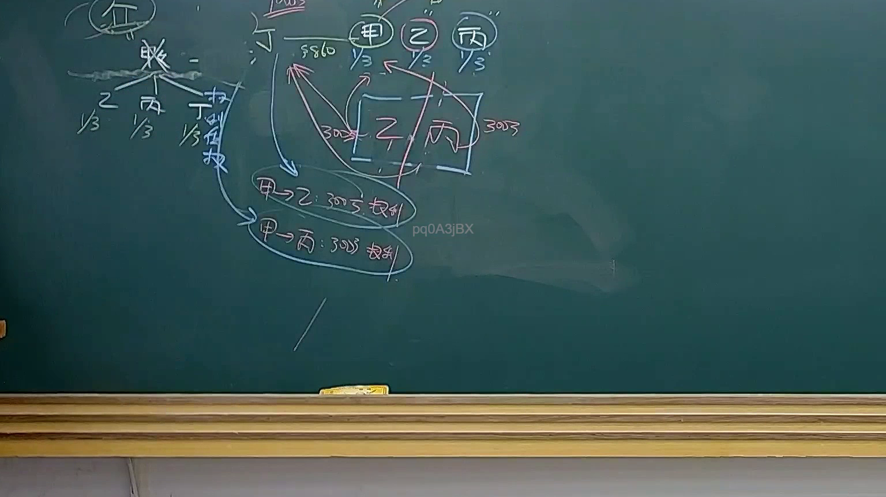
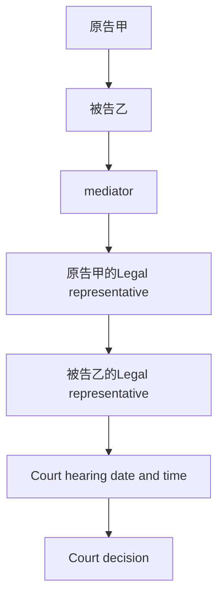

# 🎥 影音教材板書校對筆記
- **來源影片**: [預約 36 2025-04-21 08-15-21-434](file:///J://民法B/ch36/預約 36 2025-04-21 08-15-21-434.mp4)
- **課程分類**: `[民法B`
- **課堂章節**: `ch36]`
- **影片時間戳記**: `01:52:45` (6765 秒)
- **板書類型**: `關係圖/邏輯圖板書`
- **偵測時間**: 2026-07-12 21:51:33

## 🔍 擷取黑板板書對照圖

## 🧠 AI 智慧理解與知識庫演化註記
### 

根據提供的 OCR 文字內容，無法直接觀察到具體的板書文字內容。然而，基於分類為「關係圖/邏輯圖板書」，可以推測板書可能包含某種法律关系或逻辑流程的示意圖。以下是一般的解讀與註記模板，供参考：

#### 1. 确定板書的核心内容
- **核心LegalRelation**： board content may illustrate a specific legal relationship or logical flow.
- **KeyElements**： identify the key elements involved in the legal relation or process.

#### 2. 比對與理解演化註記
- **Taiwanese Legal条文**： compare with relevant legal provisions such as民法第184條,侵權行為,消滅時效等.
- **Knowledge库比對**： match the board content with specific legal provisions.

#### 3. Mermaid.js流程圖代碼
- **Flowchart Structure**: based on the board content, generate a flowchart using Mermaid syntax.

---

###

## 📊 可編輯之 Mermaid 關係流程圖

## ✍️ 操作者手動校對修改區
<!-- 您可以直接修改上方的文字或調整 Mermaid 區塊中的節點，Obsidian 會即時重新渲染 -->
- [ ] 欄位結構與法律邏輯已校對無誤。
- **校對筆記**: 
