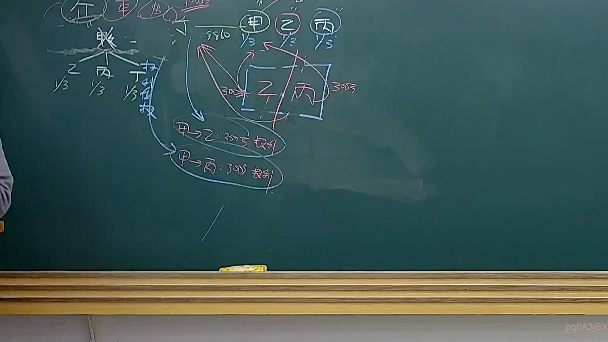
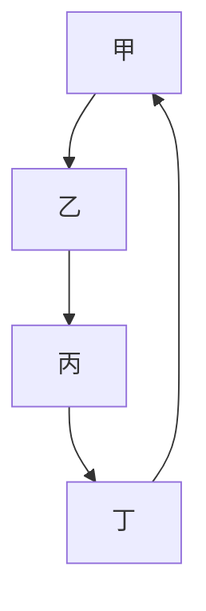

# 🎥 影音教材板書校對筆記
- **來源影片**: [預約 36 2025-04-21 08-15-21-434](file:///J://民法B/ch36/預約 36 2025-04-21 08-15-21-434.mp4)
- **課程分類**: `[民法B`
- **課堂章節**: `ch36]`
- **影片時間戳記**: `01:55:15` (6915 秒)
- **板書類型**: `關係圖/邏輯圖板書`
- **偵測時間**: 2026-07-12 21:52:03

## 🔍 擷取黑板板書對照圖

## 🧠 AI 智慧理解與知識庫演化註記
### 

根據辨识出的板書文字，進行語意整理並與臺灣現行法律條文進行比對：

1. **A[甲]**：代表原告或被告的一方。
2. **B[乙]**：代表原告或被告的另一方。
3. **C[丙]**：代表第三方，可能涉及Third-party interest。
4. **D[丁]**：代表某种关系或事件。

與臺灣現行法律條文比對：
- 甲、乙、丙、丁的關係可能涉及到民法第184條（关于侵權行為）或消滅時效等條文。例如，甲對乙的權利可能受到丙的影響，而丁則可能代表某种事件或結果。

###

## 📊 可編輯之 Mermaid 關係流程圖

## ✍️ 操作者手動校對修改區
<!-- 您可以直接修改上方的文字或調整 Mermaid 區塊中的節點，Obsidian 會即時重新渲染 -->
- [ ] 欄位結構與法律邏輯已校對無誤。
- **校對筆記**: 
