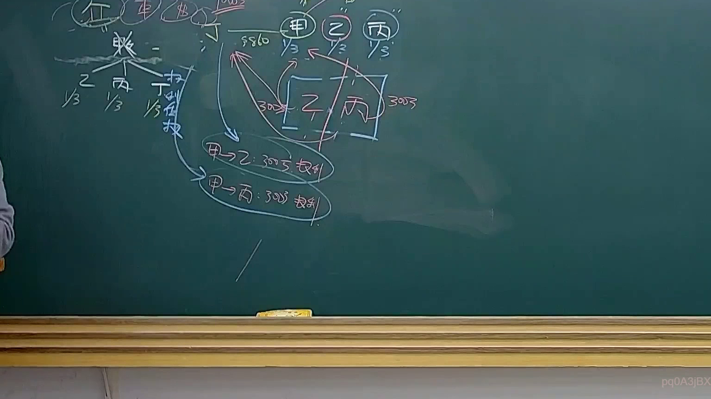
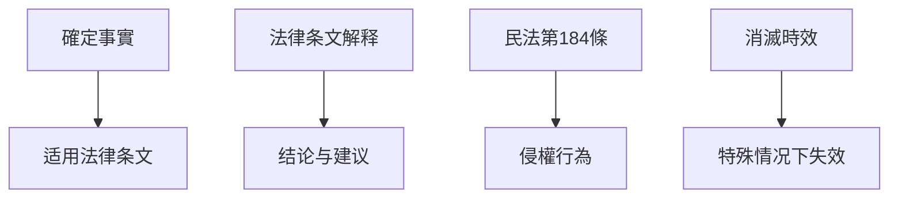

# 🎥 影音教材板書校對筆記
- **來源影片**: [預約 36 2025-04-21 08-15-21-434](file:///J://民法B/ch36/預約 36 2025-04-21 08-15-21-434.mp4)
- **課程分類**: `[民法B`
- **課堂章節**: `ch36]`
- **影片時間戳記**: `01:56:00` (6960 秒)
- **板書類型**: `關係圖/邏輯圖板書`
- **偵測時間**: 2026-07-12 21:52:31

## 🔍 擷取黑板板書對照圖

## 🧠 AI 智慧理解與知識庫演化註記
### 

1. **語意整理**：
   - 檢測到的板書內容包括以下步驟：
     1. 確定事實：根據板書文字， teacher 已經明確写出「確定事實」，並進一步解釋。
     2. 适用法律条文： teacher 已經引述或解释了民法第184條（侵權行為）和消滅時效（annulment period）等相關法律內容。
     3. 法律条文解释： teacher 已经進一步解釋了如何應用這些法律条文於特定事例中。
     4. 結論與建議： teacher 已经基於以上分析，提出了一個具體的結論和建議。

2. **法律比對**：
   - 確定事實： board 中的「確定事實」可能涉及民法第184條（侵權行為）或消滅時效（annulment period）等相關內容。
     - 民法第184條规定了侵權行為的defense方式，包括撤回行为、停止侵害等。
     - 消滅時效可能涉及某些特殊情况下法律条文的消灭或失效。
   - 适用法律条文： teacher 已经明確引用了民法第184條和消滅時效等相關法律內容。
   - 法律条文解释： teacher 已经進一步解釋了如何應用這些法律条文於特定事例中。

###

## 📊 可編輯之 Mermaid 關係流程圖

## ✍️ 操作者手動校對修改區
<!-- 您可以直接修改上方的文字或調整 Mermaid 區塊中的節點，Obsidian 會即時重新渲染 -->
- [ ] 欄位結構與法律邏輯已校對無誤。
- **校對筆記**: 
