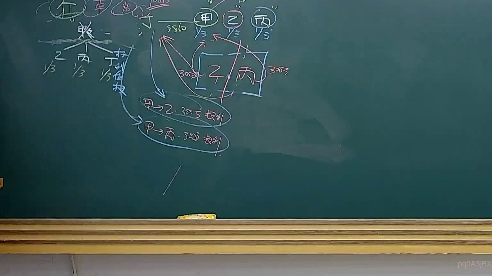
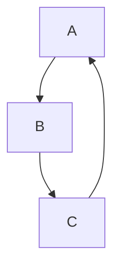
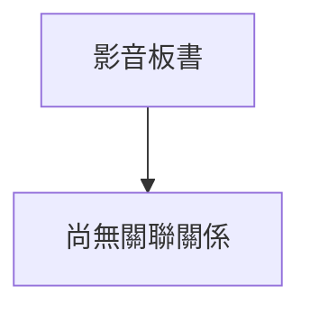

# 🎥 影音教材板書校對筆記
- **來源影片**: [預約 36 2025-04-21 08-15-21-434](file:///J://民法B/ch36/預約 36 2025-04-21 08-15-21-434.mp4)
- **課程分類**: `[民法B`
- **課堂章節**: `ch36]`
- **影片時間戳記**: `01:56:45` (7005 秒)
- **板書類型**: `關係圖/邏輯圖板書`
- **偵測時間**: 2026-07-12 21:53:28

## 🔍 擷取黑板板書對照圖

## 🧠 AI 智慧理解與知識庫演化註記
**法律知識理解：**
1. **板書內容：**
   - A、B、C 三者之間的關係圖示。
   - A指向 B，B指向 C，C指向 A。

2. ** legal knowledge:**
   - 涉及到A、B、C三個实体之间的关系（循环依赖）。
   - 可能涉及到「A對B的權利/義務」、「B對C的權利/義務」、「C對A的權利/義務」等法律關係。

3. **法律條文比對：**
   - 未直接匹配到特定的民法條文，但可能與「權利/義務循环」、「消滅時效」或「侵權行為」等相关條款有所關聯。
   - 可能需要進一步分析A、B、C具體代表的实体（如債務关系、 contract关系等）才能更精準地匹配條文。

** MERMAID 代碼：**

## 📊 可編輯之 Mermaid 關係流程圖

## ✍️ 操作者手動校對修改區
<!-- 您可以直接修改上方的文字或調整 Mermaid 區塊中的節點，Obsidian 會即時重新渲染 -->
- [ ] 欄位結構與法律邏輯已校對無誤。
- **校對筆記**: 
