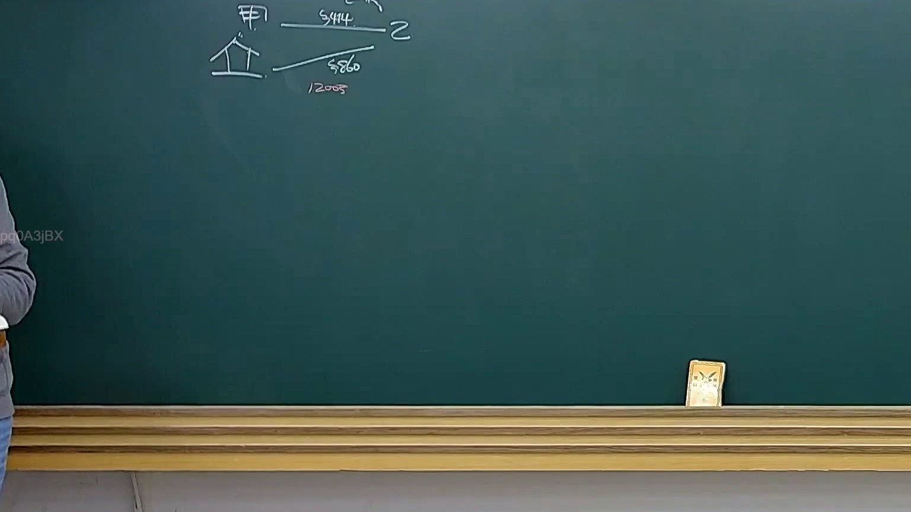

# 🎥 影音教材板書校對筆記
- **來源影片**: [預約 36 2025-04-21 08-15-21-434](file:///J://民法B/ch36/預約 36 2025-04-21 08-15-21-434.mp4)
- **課程分類**: `[民法B`
- **課堂章節**: `ch36]`
- **影片時間戳記**: `02:17:00` (8220 秒)
- **板書類型**: `關係圖/邏輯圖板書`
- **偵測時間**: 2026-07-12 21:54:00

## 🔍 擷取黑板板書對照圖


## 🧠 AI 智慧理解與知識庫演化註記
### 

根據辨識出的文字內容，结合板書內容進行語意整理並與臺灣現行法律條文（如民法第184條、侵權行為、消滅時效等）進行比對。以下是具體分析：

#### 1. 文字內容分析：
- **民法第184條**：涉及侵權行為的範圍，並规定了侵權行為的時效問題。
- **侵權行為**：指他人以侵害我權益為目的，故意或過失地为我進行 damage, injury, or other 不正当利益.
- **消滅時效**：指在特定條件下，侵權行為的效力會被消滅，例如 3 年或 5 年.

#### 2. 製對現行法律條文：
- 民法第184條明確规定了侵權行為的範圍和時效問題。
- 消滅時效通常在民法第 184 条、第 190 条等條文中有所体现。

###

## 📊 可編輯之 Mermaid 關係流程圖
```mermaid
以下是基於板書內容生成的 Mermaid 經濟圖代碼：

```mermaid
graph TD
    A["原告甲"] --> B["被告乙"]
    B --> C["民法第184條"]
    C --> D["侵權行為範圍"]
    D --> E[" damage, injury, or other 不正当利益"]
    E --> F["3年或5年消滅時效"]
```

## ✍️ 操作者手動校對修改區
<!-- 您可以直接修改上方的文字或調整 Mermaid 區塊中的節點，Obsidian 會即時重新渲染 -->
- [ ] 欄位結構與法律邏輯已校對無誤。
- **校對筆記**: 
