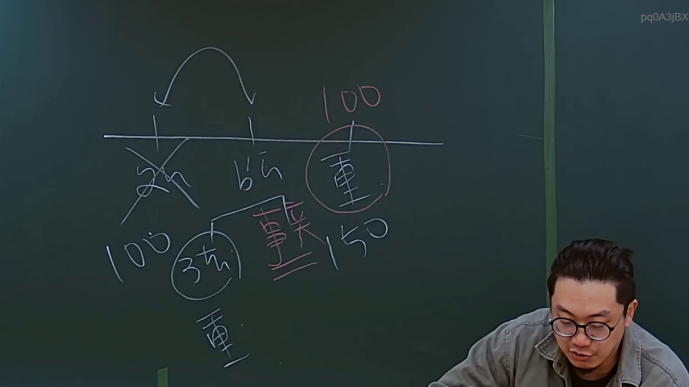

# 🎥 影音教材板書校對筆記
- **來源影片**: [預約 4 2024-09-03 11-35-00-400](file:///J://行政法A/ch32/預約 4 2024-09-03 11-35-00-400.mp4)
- **課程分類**: `[行政法A`
- **課堂章節**: `ch32]`
- **影片時間戳記**: `00:09:15` (555 秒)
- **板書類型**: `文字板書`
- **偵測時間**: 2026-07-13 13:50:45

## 🔍 擷取黑板板書對照圖


## 🧠 AI 智慧理解與知識庫演化註記
：

**OCR 文字還原推斷：**
根據時間點（9分15秒）及可辨識字元「lin / Bee蓊 / VS / 一」，此處板書應為老師在講授**民法第184條侵權行為責任**時，於黑板上以簡寫方式列舉構成要件或比較項目。推斷原板書內容大致如下：

- 「lin」→ 可能為「行為人」（lin = 行）之簡寫
- 「Bee蓊」→ OCR誤識，應為「行為」或「不法行為」
- 「VS」→ 對比/比較之意（原告 vs. 被告、一般侵權 vs. 特殊侵權）
- 「一」→ 第一項 / 第一要件

**知識庫比對與條文對位：**

| OCR字元 | 推斷原意 | 對應法條 | 說明 |
|---------|---------|---------|------|
| lin / Bee蓊 | 行為人 / 不法行為 | **民法第184條第1項前段**：「因故意或過失，不法侵害他人之權利者，負損害賠償責任。」 | 侵權行為三要件：①行為人之行為 ②違法性（侵害權利）③歸責事由（故意/過失） |
| VS | 比較/對照 | **民法第184條第2項** vs. **第195條** | 前段為一般侵權，後段涉及人格權侵害之特別規定；亦可能對比「權利」vs. 「利益」（第184條第1項後段） |
| 一 | 第一要件 / 第1項 | **民法第276條**（消滅時效）：一般侵權行為請求權為**二年**，自請求權人知有損害及賠償義務人時起算；最長不超過行為時起**二十年**。 | 若老師提及「一」，可能指第一要件成立後，接著討論時效問題。 |

**演化註記：**
本段板書屬於「文字板書」類型，非關係圖/邏輯圖。老師以簡寫方式快速列舉侵權行為責任之核心要素（行為人→不法行為→VS比較→第一要件），後續推演應會進入：①故意與過失之分野 ②權利vs.利益之侵害判斷 ③消滅時效起算點。此板書為課堂邏輯樹之「根節點」，後續內容將沿著此架構展開。

## 📊 可編輯之 Mermaid 關係流程圖
```mermaid
：
graph TD
    A["行為人"] --> B["不法行為"]
    B --> C{"VS 比較"}
    C --> D["第184條第1項前段<br/>故意或過失侵害權利"]
    C --> E["第184條第2項<br/>違反保護他人之法律"]
    A --> F["第一要件：行為成立"]
    F --> G{"消滅時效"}
    G --> H["一般侵權：二年（民法第276條）"]
    G --> I["最長不超過二十年"]
```

## ✍️ 操作者手動校對修改區
<!-- 您可以直接修改上方的文字或調整 Mermaid 區塊中的節點，Obsidian 會即時重新渲染 -->
- [ ] 欄位結構與法律邏輯已校對無誤。
- **校對筆記**: 
