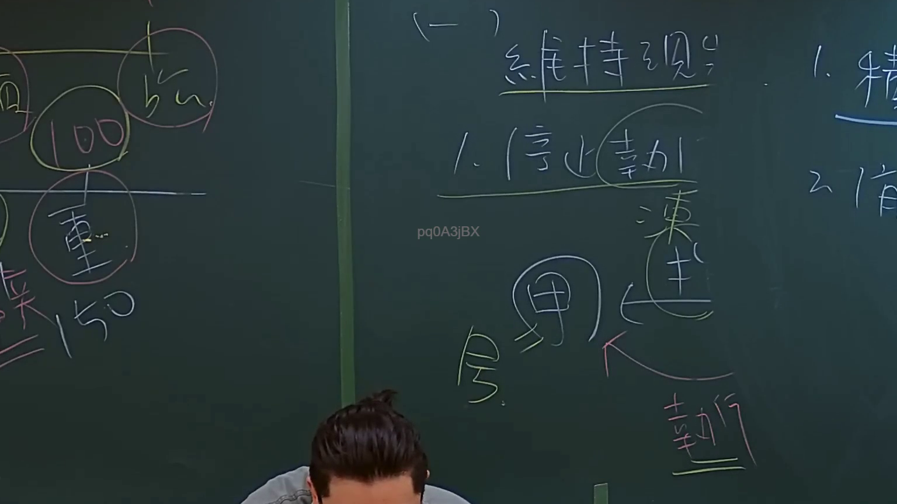
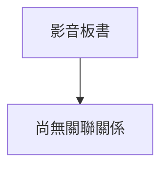

# 🎥 影音教材板書校對筆記
- **來源影片**: [預約 4 2024-09-03 11-35-00-400](file:///J://行政法A/ch32/預約 4 2024-09-03 11-35-00-400.mp4)
- **課程分類**: `[行政法A`
- **課堂章節**: `ch32]`
- **影片時間戳記**: `00:56:15` (3375 秒)
- **板書類型**: `關係圖/邏輯圖板書`
- **偵測時間**: 2026-07-13 13:51:52

## 🔍 擷取黑板板書對照圖

## 🧠 AI 智慧理解與知識庫演化註記
：
您好，您提供的訊息中「擷取區域的 OCR 辨識字元」部分為空白，未實際附上任何文字內容。因此我無法進行語意整理、條文比對或生成 Mermaid 流程圖。

請您補充以下任一方式後重新發送：
1. **直接貼上 OCR 辨識出的文字**（例如：「民法第184條...」等）
2. **描述板書上的關鍵內容**（例如：老師寫了哪些字、畫了什麼箭頭或框線結構）

一旦收到具體的 OCR 文字，我將立即為您完成：
- 📖 語意整理與臺灣現行法律條文比對（民法第184條侵權行為責任、消滅時效等）
- 🔗 Mermaid.js 流程圖代碼生成（關係圖/邏輯圖結構）

請補充內容，我隨時待命！

## 📊 可編輯之 Mermaid 關係流程圖

## ✍️ 操作者手動校對修改區
<!-- 您可以直接修改上方的文字或調整 Mermaid 區塊中的節點，Obsidian 會即時重新渲染 -->
- [ ] 欄位結構與法律邏輯已校對無誤。
- **校對筆記**: 
