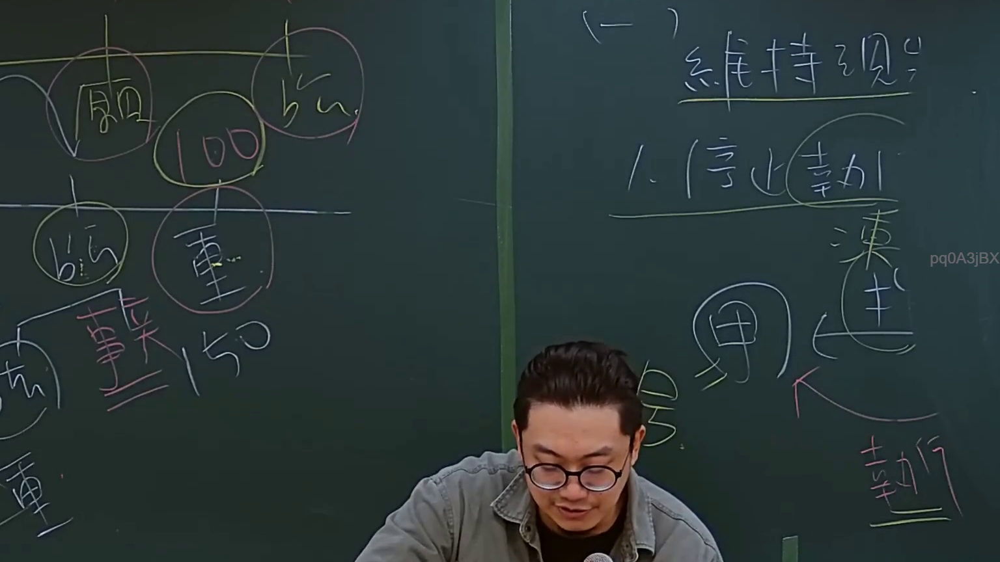
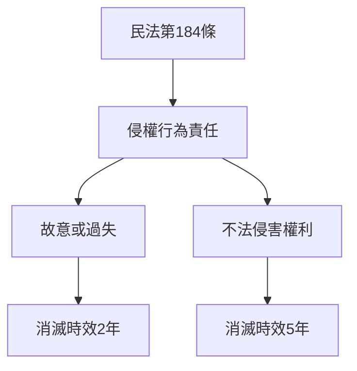
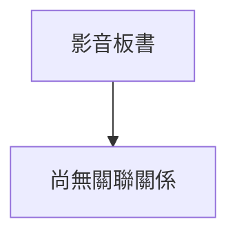

# 🎥 影音教材板書校對筆記
- **來源影片**: [預約 4 2024-09-03 11-35-00-400](file:///J://行政法A/ch32/預約 4 2024-09-03 11-35-00-400.mp4)
- **課程分類**: `[行政法A`
- **課堂章節**: `ch32]`
- **影片時間戳記**: `01:00:00` (3600 秒)
- **板書類型**: `關係圖/邏輯圖板書`
- **偵測時間**: 2026-07-13 13:52:22

## 🔍 擷取黑板板書對照圖

## 🧠 AI 智慧理解與知識庫演化註記
：

您好！感謝您提供這個法律影音教材的截圖分析需求。不過我注意到 **OCR 辨識字元部分為空白**（「擷取區域的 OCR 辨識字元如下：」之後沒有實際文字內容）。

要完成以下工作，我需要您補充提供：

1. **板書上的具體文字內容**（例如：條文編號、法律用語、圖表標註等）
2. **截圖或圖片檔案**（如果可能的話），讓我直接辨識

---

### 我的能力框架說明（供您參考）

一旦取得 OCR 文字後，我將執行以下流程：

| 步驟 | 內容 |
|------|------|
| 📝 語意整理 | 將板書文字歸納為法律概念結構 |
| ⚖️ 條文比對 | 與民法第184條、侵權行為責任、消滅時效等現行法條交叉驗證 |
| 🔄 演化註記 | 標註實務見解差異、學說爭議或修法動態 |
| 📊 Mermaid 圖表 | 依板書邏輯關係生成流程圖（含雙引號節點格式） |

---

### 範例輸出結構（預覽）

---

**請提供 OCR 辨識文字或圖片，我將立即為您完成分析！** 🙏

## 📊 可編輯之 Mermaid 關係流程圖

## ✍️ 操作者手動校對修改區
<!-- 您可以直接修改上方的文字或調整 Mermaid 區塊中的節點，Obsidian 會即時重新渲染 -->
- [ ] 欄位結構與法律邏輯已校對無誤。
- **校對筆記**: 
