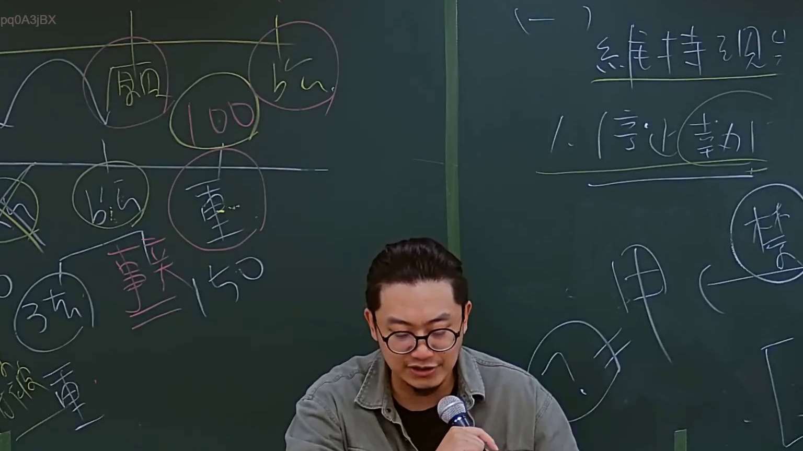
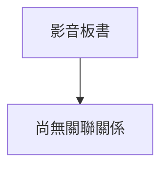

# 🎥 影音教材板書校對筆記
- **來源影片**: [預約 4 2024-09-03 11-35-00-400](file:///J://行政法A/ch32/預約 4 2024-09-03 11-35-00-400.mp4)
- **課程分類**: `[行政法A`
- **課堂章節**: `ch32]`
- **影片時間戳記**: `01:07:15` (4035 秒)
- **板書類型**: `關係圖/邏輯圖板書`
- **偵測時間**: 2026-07-13 13:52:40

## 🔍 擷取黑板板書對照圖

## 🧠 AI 智慧理解與知識庫演化註記
您好！感謝您的詳細說明，但我注意到您訊息中「擷取區域的 OCR 辨識字元如下：」之後**沒有附上實際的文字內容**。

請將老師黑板上的 OCR 辨識字串貼上給我，我才能立即為您完成以下工作：

1. **語意整理與法律條文比對**（如民法第 184 條侵權行為、消滅時效等）
2. **Mermaid.js 流程圖代碼生成**（針對關係圖/邏輯圖結構繪製）

請補充 OCR 文字，我馬上為您處理！

## 📊 可編輯之 Mermaid 關係流程圖

## ✍️ 操作者手動校對修改區
<!-- 您可以直接修改上方的文字或調整 Mermaid 區塊中的節點，Obsidian 會即時重新渲染 -->
- [ ] 欄位結構與法律邏輯已校對無誤。
- **校對筆記**: 
