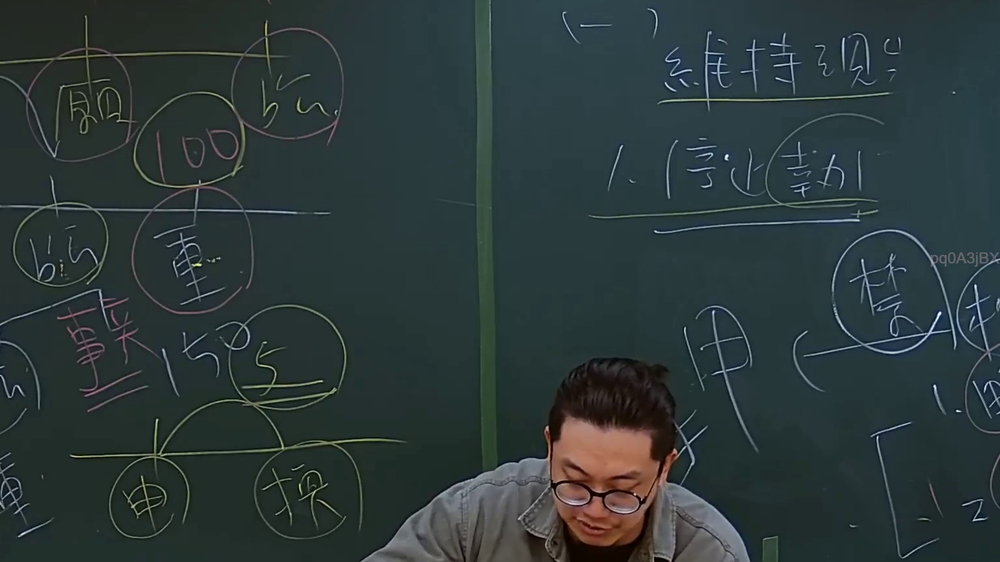
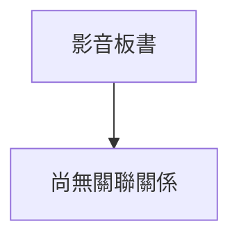

# 🎥 影音教材板書校對筆記
- **來源影片**: [預約 4 2024-09-03 11-35-00-400](file:///J://行政法A/ch32/預約 4 2024-09-03 11-35-00-400.mp4)
- **課程分類**: `[行政法A`
- **課堂章節**: `ch32]`
- **影片時間戳記**: `01:13:45` (4425 秒)
- **板書類型**: `關係圖/邏輯圖板書`
- **偵測時間**: 2026-07-13 13:53:02

## 🔍 擷取黑板板書對照圖

## 🧠 AI 智慧理解與知識庫演化註記
：
您提供的訊息中，OCR 辨識字元區域為空白（「擷取區域的 OCR 辨識字元如下：」之後沒有實際文字內容）。我無法進行語意整理、條文比對或生成 Mermaid 圖表。

請您補充以下任一方式之一：
1. **貼上 OCR 辨識出的文字**，我會立即為您完成分析；
2. **重新上傳截圖**，我可以嘗試直接從圖片中辨識板書內容。

一旦取得文字內容，我將依您的要求：
- 比對民法第184條、侵權行為責任、消滅時效等相關條文
- 生成對應的 Mermaid.js 流程圖或邏輯樹代碼

## 📊 可編輯之 Mermaid 關係流程圖

## ✍️ 操作者手動校對修改區
<!-- 您可以直接修改上方的文字或調整 Mermaid 區塊中的節點，Obsidian 會即時重新渲染 -->
- [ ] 欄位結構與法律邏輯已校對無誤。
- **校對筆記**: 
