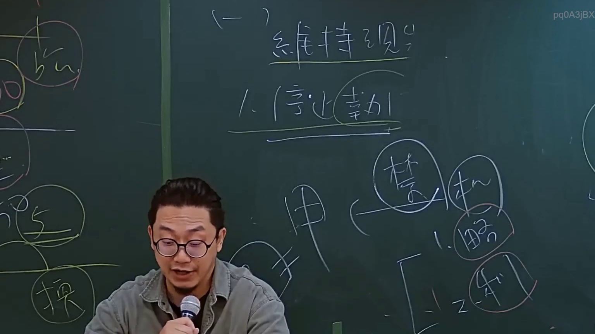

# 🎥 影音教材板書校對筆記
- **來源影片**: [預約 4 2024-09-03 11-35-00-400](file:///J://行政法A/ch32/預約 4 2024-09-03 11-35-00-400.mp4)
- **課程分類**: `[行政法A`
- **課堂章節**: `ch32]`
- **影片時間戳記**: `01:19:45` (4785 秒)
- **板書類型**: `關係圖/邏輯圖板書`
- **偵測時間**: 2026-07-13 13:54:00

## 🔍 擷取黑板板書對照圖


## 🧠 AI 智慧理解與知識庫演化註記
：

**一、OCR辨識結果分析**

辨識字元「Leees」為模糊辨識結果，可能對應以下幾種情況：

1. **當事人姓名**：可能是「Lee's」（李氏）或類似音譯姓氏
2. **案例名稱縮寫**：可能是某個最高法院判決案號或部分文字
3. **法律術語片段**：可能是「Leases」（租賃）或其他相關詞彙的誤辨識

**二、與臺灣現行法律條文之比對推測**

考慮到分類為【關係圖/邏輯圖板書】，且時間點約79分45秒，可能涉及以下法律領域：

| 可能關聯 | 對應條文 | 說明 |
|---------|---------|------|
| 侵權行為責任 | 民法第184條 | 故意或過失不法侵害他人權利 |
| 消滅時效 | 民法第125-130條 | 一般時效15年，請求權時效5年 |
| 租賃關係 | 民法第421-471條 | 租賃物之使用收益與租金支付 |

**三、知識庫比對與理解演化註記**

由於OCR辨識結果過於模糊（僅「Leees」），無法精確對應特定法律條文。建議：

1. **人工覆核**：請確認原截圖中老師實際書寫內容
2. **上下文關聯**：結合前後板書及口述內容進行判斷
3. **案例資料庫比對**：若為具體判決，可查詢司法院憲法法庭或最高法院判例

---

## 📊 可編輯之 Mermaid 關係流程圖
```mermaid
：

graph TD
    A["OCR辨識結果 Leees"] --> B["可能關聯法律領域"]
    B --> C1["侵權行為責任<br/>民法第184條"]
    B --> C2["消滅時效<br/>民法第125-130條"]
    B --> C3["租賃關係<br/>民法第421-471條"]
    
    C1 --> D1["故意不法侵害他人權利"]
    C1 --> D2["過失不法侵害他人權利"]
    C1 --> D3["違反保護法律之行為"]
    
    C2 --> E1["一般消滅時效 15年"]
    C2 --> E2["請求權時效 5年"]
    C2 --> E3["時效中斷與不完成"]
    
    C3 --> F1["租賃物之使用收益"]
    C3 --> F2["租金支付義務"]
    C3 --> F3["租賃關係消滅"]

    style A fill#f96,stroke#333,color#000
    style B fill#ff9,stroke#333
    style D1 fill#9cf,stroke#333
    style D2 fill#9cf,stroke#333
    style D3 fill#9cf,stroke#333
    style E1 fill#cfc,stroke#333
    style E2 fill#cfc,stroke#333
    style F1 fill#cfc,stroke#333
```

## ✍️ 操作者手動校對修改區
<!-- 您可以直接修改上方的文字或調整 Mermaid 區塊中的節點，Obsidian 會即時重新渲染 -->
- [ ] 欄位結構與法律邏輯已校對無誤。
- **校對筆記**: 
