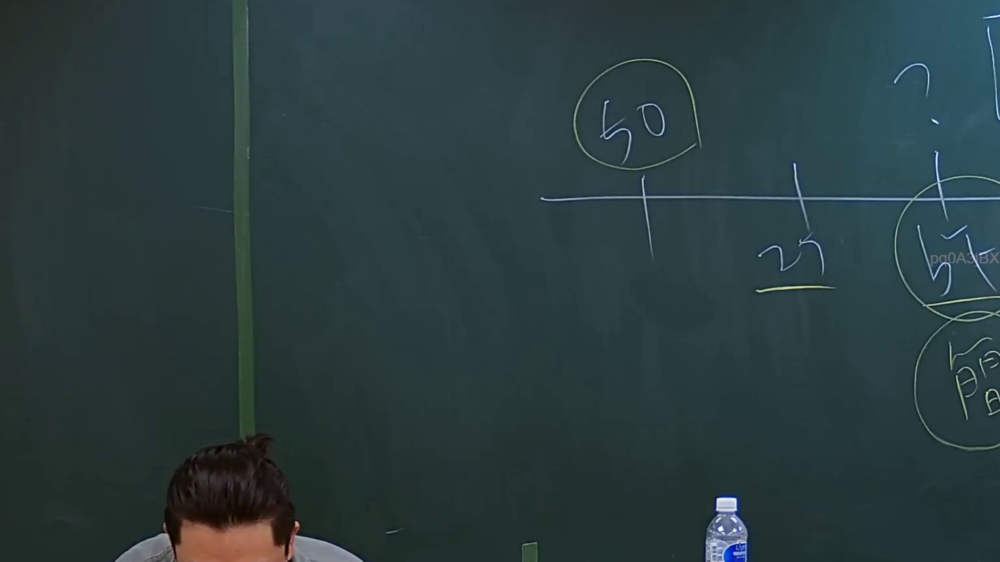

# 🎥 影音教材板書校對筆記
- **來源影片**: [預約 4 2024-09-03 11-35-00-400](file:///J://行政法A/ch32/預約 4 2024-09-03 11-35-00-400.mp4)
- **課程分類**: `[行政法A`
- **課堂章節**: `ch32]`
- **影片時間戳記**: `01:35:00` (5700 秒)
- **板書類型**: `關係圖/邏輯圖板書`
- **偵測時間**: 2026-07-13 13:54:28

## 🔍 擷取黑板板書對照圖


## 🧠 AI 智慧理解與知識庫演化註記
：

您好，您提供的訊息中「擷取區域的 OCR 辨識字元」部分為空白，未實際附上老師板書上的文字內容。因此我無法進行以下工作：

1. **語意整理** — 無辨識文字可分析
2. **條文比對**（民法第184條、侵權行為、消滅時效等）— 無具體法律概念可供對位
3. **Mermaid.js 流程圖生成** — 無法繪製關係圖或邏輯樹

---

請您補充以下任一方式，我即可立即為您完成：

- 📋 **直接貼上 OCR 辨識出的文字內容**（即使有錯字也無妨）
- 🖼️ **提供截圖圖片**，我可自行進行 OCR 辨識與分析

一旦收到板書文字，我會依您的要求輸出：
1. — 語意整理 + 條文比對演化註記
2.

## 📊 可編輯之 Mermaid 關係流程圖
```mermaid
— 完整的 Mermaid 流程圖（含雙引號節點格式）

期待您的補充！
```

## ✍️ 操作者手動校對修改區
<!-- 您可以直接修改上方的文字或調整 Mermaid 區塊中的節點，Obsidian 會即時重新渲染 -->
- [ ] 欄位結構與法律邏輯已校對無誤。
- **校對筆記**: 
