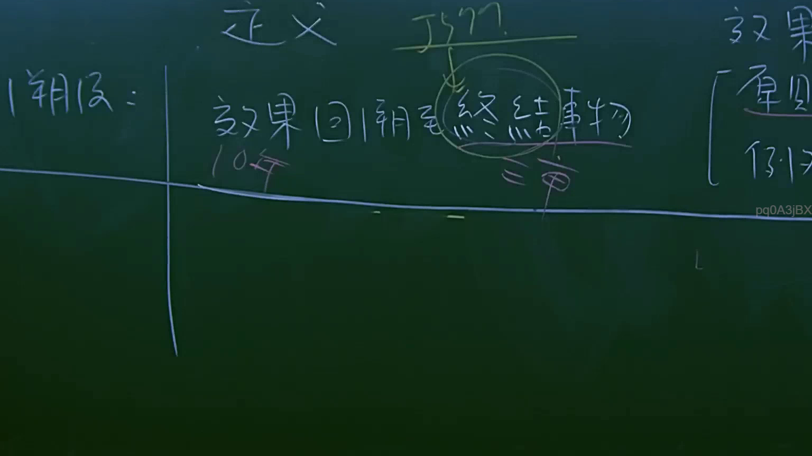
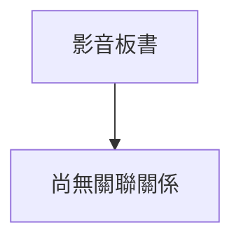

# 🎥 影音教材板書校對筆記
- **來源影片**: [預約 4 2025-07-23 11-59-09-157](file:///J://行政法A/ch4/預約 4 2025-07-23 11-59-09-157.mp4)
- **課程分類**: `[行政法A`
- **課堂章節**: `ch4]`
- **影片時間戳記**: `00:26:45` (1605 秒)
- **板書類型**: `關係圖/邏輯圖板書`
- **偵測時間**: 2026-07-13 10:42:58

## 🔍 擷取黑板板書對照圖

## 🧠 AI 智慧理解與知識庫演化註記
：
抱歉，您提供的訊息中「擷取區域的 OCR 辨識字元」部分為空白，未實際附上任何文字內容。我無法在沒有 OCR 辨識結果的情況下進行語意整理、條文比對或生成 Mermaid 圖表。

請將老師板書上的 OCR 辨識字串貼上，我再為您完成：
1. 語意整理與民法第184條（侵權行為）、消滅時效等條文的知識庫比對註記
2. 對應的 Mermaid.js 流程圖/邏輯樹代碼

請補充 OCR 文字後重新提問。

## 📊 可編輯之 Mermaid 關係流程圖

## ✍️ 操作者手動校對修改區
<!-- 您可以直接修改上方的文字或調整 Mermaid 區塊中的節點，Obsidian 會即時重新渲染 -->
- [ ] 欄位結構與法律邏輯已校對無誤。
- **校對筆記**: 
