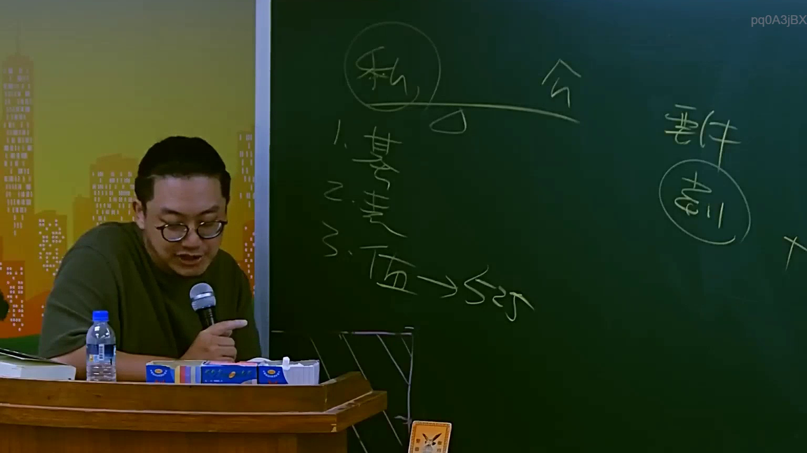

# 🎥 影音教材板書校對筆記
- **來源影片**: [預約 4 2025-07-23 11-59-09-157](file:///J://行政法A/ch4/預約 4 2025-07-23 11-59-09-157.mp4)
- **課程分類**: `[行政法A`
- **課堂章節**: `ch4]`
- **影片時間戳記**: `01:20:45` (4845 秒)
- **板書類型**: `關係圖/邏輯圖板書`
- **偵測時間**: 2026-07-13 10:43:38

## 🔍 擷取黑板板書對照圖


## 🧠 AI 智慧理解與知識庫演化註記
：
您提供的訊息中，「擷取區域的 OCR 辨識字元」部分為空白，未實際貼上任何文字內容。因此我無法進行以下工作：

1. **語意整理** — 無辨識字元可供分析
2. **條文比對**（如民法第184條侵權行為、消滅時效等）— 無具體法律概念可對位
3. **Mermaid 流程圖生成** — 無邏輯結構可依繪製

---

## 📊 可編輯之 Mermaid 關係流程圖
```mermaid
：
（待提供 OCR 文字後再行生成）

---

📌 **請您補充以下任一方式，我即可立即完成分析：**

- **直接貼上 OCR 辨識出的字元**（例如：「原告甲 → 被告乙 → 侵權行為責任...」等）
- **描述板書上的圖畫結構或文字內容**（我會依您的描述重建 Mermaid 代碼）

一旦收到具體內容，我將立即執行：
1. 語意整理與法律條文比對註記
2. 對應的 Mermaid.js 流程圖代碼
```

## ✍️ 操作者手動校對修改區
<!-- 您可以直接修改上方的文字或調整 Mermaid 區塊中的節點，Obsidian 會即時重新渲染 -->
- [ ] 欄位結構與法律邏輯已校對無誤。
- **校對筆記**: 
