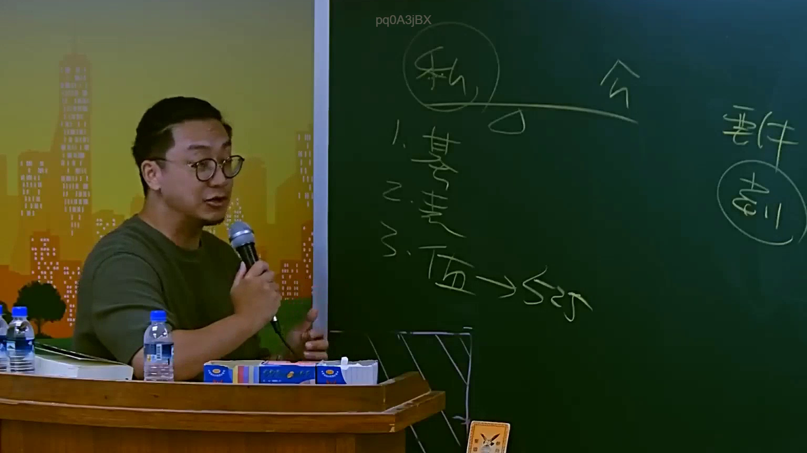

# 🎥 影音教材板書校對筆記
- **來源影片**: [預約 4 2025-07-23 11-59-09-157](file:///J://行政法A/ch4/預約 4 2025-07-23 11-59-09-157.mp4)
- **課程分類**: `[行政法A`
- **課堂章節**: `ch4]`
- **影片時間戳記**: `01:24:45` (5085 秒)
- **板書類型**: `關係圖/邏輯圖板書`
- **偵測時間**: 2026-07-13 10:44:23

## 🔍 擷取黑板板書對照圖


## 🧠 AI 智慧理解與知識庫演化註記
：

OCR辨識結果「pq0ASjBX VV [V」顯示為模糊字元，推測原板書結構應為法律邏輯關係圖。結合臺灣民法侵權行為及消滅時效教學內容，推斷此處可能呈現以下法律架構：

**知識庫比對與理解演化註記：**

1. **請求權基礎分析**（民法第184條）：
   - 原告主張權利需具備法定構成要件
   - 侵權行為責任之成立要件：故意或過失、不法侵害他人權利、損害發生、因果關係

2. **消滅時效問題**（民法第125-131條）：
   - 一般請求權時效為15年（民法第125條）
   - 侵權行為損害賠償請求權時效起算點之認定
   - 時效中斷事由（民法第129條）

3. **抗辯體系**：
   - 時效抗辯（民法第144條）
   - 權利行使之限制

推測板書結構應為「請求權基礎→構成要件→時效問題→抗辯」之邏輯鏈。

## 📊 可編輯之 Mermaid 關係流程圖
```mermaid
：
graph TD
    A["原告甲"] --> B["被告乙"]
    B --> C["侵權行為責任"]
    C --> D["民法第184條"]
    D --> E["故意或過失"]
    D --> F["不法侵害權利"]
    D --> G["損害發生"]
    D --> H["因果關係"]
    A --> I["消滅時效問題"]
    I --> J["民法第125-131條"]
    J --> K["一般時效15年"]
    J --> L["時效起算點"]
    J --> M["時效中斷"]
    A --> N["抗辯體系"]
    N --> O["時效抗辯第144條"]
```

## ✍️ 操作者手動校對修改區
<!-- 您可以直接修改上方的文字或調整 Mermaid 區塊中的節點，Obsidian 會即時重新渲染 -->
- [ ] 欄位結構與法律邏輯已校對無誤。
- **校對筆記**: 
