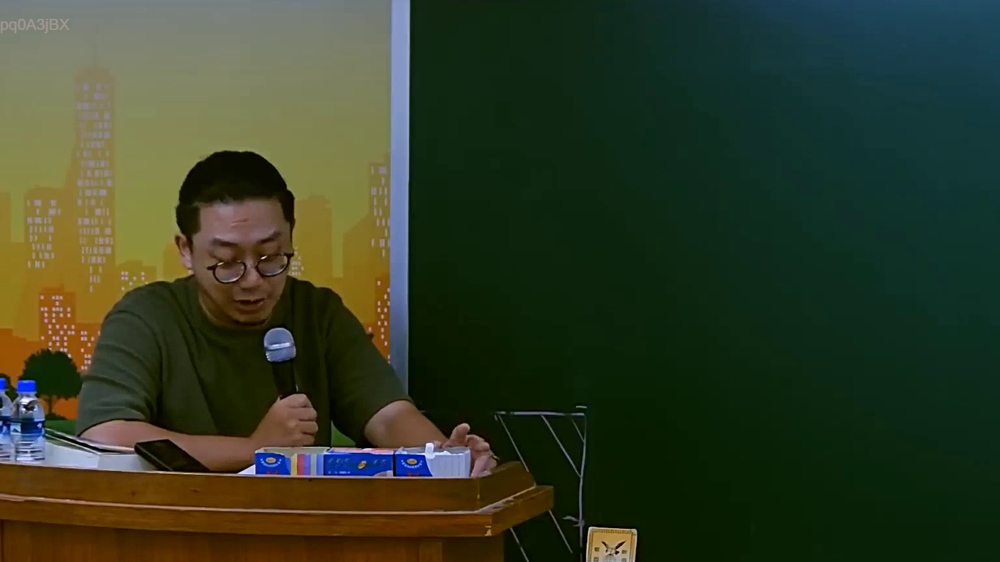
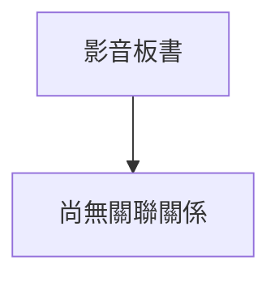

# 🎥 影音教材板書校對筆記
- **來源影片**: [預約 4 2025-07-23 11-59-09-157](file:///J://行政法A/ch4/預約 4 2025-07-23 11-59-09-157.mp4)
- **課程分類**: `[行政法A`
- **課堂章節**: `ch4]`
- **影片時間戳記**: `01:54:45` (6885 秒)
- **板書類型**: `關係圖/邏輯圖板書`
- **偵測時間**: 2026-07-13 10:44:52

## 🔍 擷取黑板板書對照圖

## 🧠 AI 智慧理解與知識庫演化註記
：
您好，我注意到您提供的訊息中「擷取區域的 OCR 辨識字元」部分為空白，未實際顯示任何文字內容。因此我無法針對板書文字進行語意整理、條文比對或生成 Mermaid 流程圖。

請您補充提供以下任一資訊後，我再為您完成分析：
1. **OCR 辨識出的原始字串**（直接貼上即可）
2. 或 **截圖本身**（若平台支援圖片上傳）

一旦收到文字內容，我將立即執行：
- 📖 語意整理與臺灣現行法律條文比對（民法第184條、侵權行為、消滅時效等）
- 🔄 生成對應的 Mermaid.js 流程圖代碼

期待您的補充！

## 📊 可編輯之 Mermaid 關係流程圖

## ✍️ 操作者手動校對修改區
<!-- 您可以直接修改上方的文字或調整 Mermaid 區塊中的節點，Obsidian 會即時重新渲染 -->
- [ ] 欄位結構與法律邏輯已校對無誤。
- **校對筆記**: 
