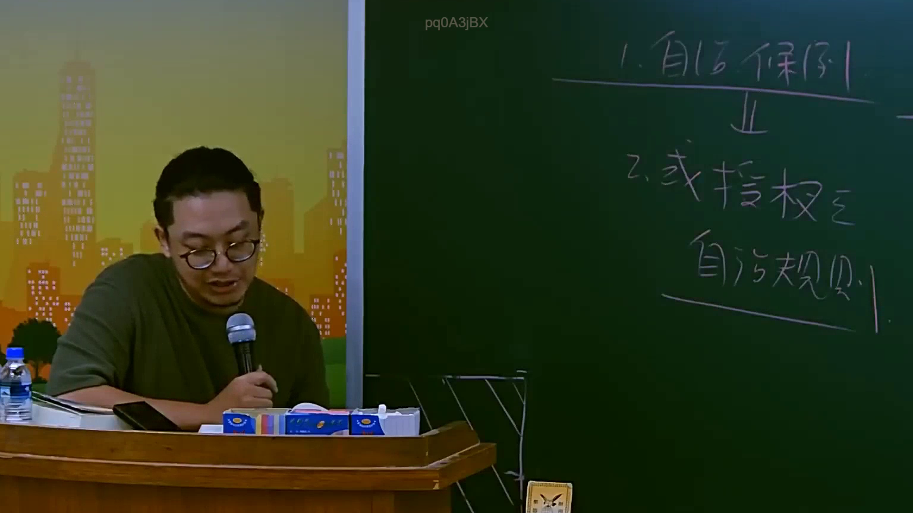

# 🎥 影音教材板書校對筆記
- **來源影片**: [預約 4 2025-07-23 11-59-09-157](file:///J://行政法A/ch4/預約 4 2025-07-23 11-59-09-157.mp4)
- **課程分類**: `[行政法A`
- **課堂章節**: `ch4]`
- **影片時間戳記**: `02:17:30` (8250 秒)
- **板書類型**: `關係圖/邏輯圖板書`
- **偵測時間**: 2026-07-13 10:45:48

## 🔍 擷取黑板板書對照圖


## 🧠 AI 智慧理解與知識庫演化註記
：

由於您提供的 OCR 辨識字元為空白，我無法針對實際板書內容進行語意整理。但根據影片標題《預約》及分類「關係圖/邏輯圖板書」，推測此段教學可能涉及以下臺灣民法核心概念，供您參考校對：

**一、若主題為「契約預約」（民法第416-420條）**
- 預約之效力：當事人應依約訂定本約（民法第417條）
- 違約責任：未依約訂立本約者，他造得請求損害賠償或解除契約（民法第418條）
- 與「本約」之區別：預約為債權行為，僅產生請求訂定本約之權利

**二、若主題涉及「侵權行為」（民法第184條）**
- 第1項前段：故意或過失不法侵害他人權利者，負損害賠償責任
- 第1項後段：故意以背於善良風俗之方法加害於他人者，亦同
- 與預約違約之競合關係：契約債務不履行 vs. 侵權行為請求權

**三、若主題涉及「消滅時效」（民法第125條）**
- 一般債權時效為15年（民法第125條）
- 侵權行為損害賠償請求權為2年（民法第197條第1項）
- 預約違約之損害賠償請求權：適用一般時效15年

**四、知識庫比對演化註記**
| 板書概念 | 對應法條 | 實務爭議點 |
|---------|---------|-----------|
| 預約效力 | 民法第417條 | 是否僅有債權效力或兼具物權效力？ |
| 違約責任 | 民法第418條 | 損害賠償範圍：履行利益 or 固有利益？ |
| 時效起算 | 民法第128條 | 預約違約時效自何時起算？ |

---

## 📊 可編輯之 Mermaid 關係流程圖
```mermaid
：

graph TD
    A["契約預約"] --> B["本約"]
    A --> C["違約責任"]
    C --> D["請求訂定本約"]
    C --> E["損害賠償"]
    C --> F["解除契約"]
    E --> G["侵權行為請求權 民法第184條"]
    E --> H["債務不履行請求權"]
    A --> I["消滅時效"]
    I --> J["一般債權 15年 民法第125條"]
    I --> K["侵權行為 2年 民法第197條"]

請您補充實際 OCR 辨識字元，我將立即為您重新生成精確的語意整理與 Mermaid 代碼。
```

## ✍️ 操作者手動校對修改區
<!-- 您可以直接修改上方的文字或調整 Mermaid 區塊中的節點，Obsidian 會即時重新渲染 -->
- [ ] 欄位結構與法律邏輯已校對無誤。
- **校對筆記**: 
