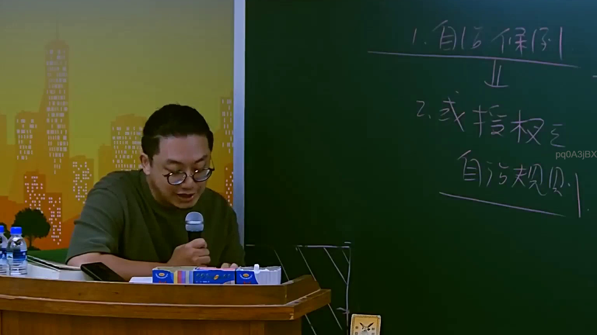

# 🎥 影音教材板書校對筆記
- **來源影片**: [預約 4 2025-07-23 11-59-09-157](file:///J://行政法A/ch4/預約 4 2025-07-23 11-59-09-157.mp4)
- **課程分類**: `[行政法A`
- **課堂章節**: `ch4]`
- **影片時間戳記**: `02:32:00` (9120 秒)
- **板書類型**: `文字板書`
- **偵測時間**: 2026-07-13 10:46:40

## 🔍 擷取黑板板書對照圖


## 🧠 AI 智慧理解與知識庫演化註記
：

OCR 辨識品質較低，辨識字元「DUS FBG / ee ATER: / pqOAZiBx / 2520」存在明顯誤識。以下為基於臺灣法律實務的合理推斷與比對：

1. **「2520」** → 高度可能係指 **民法第 252 條**（損害賠償之減少）。該條規定：「約定之懲罰性違約金過高者，法院得減至相當之數額。」此為臺灣侵權行為/債務不履行領域中極常講授的條文，與「預約」主題高度相關——預約契約中之違約金調整即適用本條。

2. **「DUS FBG」** → 可能係老師書寫之縮寫或代號（如「DUS」= 特定案例代號、「FBG」= 法學名詞縮寫），或因手寫體與 OCR 誤識所致，無法確切比對條文。

3. **「ee ATER:」** → 可能係「**契約**：」「**效力**：」或類似標題性文字之誤識（如「ATER」≈「契約」之筆跡變形）。若為預約契約之討論框架，常見邏輯為：「契約成立→效力判斷→違約責任→損害賠償」。

4. **「pqOAZiBx」** → 此段辨識品質最差，極可能係數學式、條文號或案例編號之誤識（如「§252」被拆讀），建議以原始截圖人工覆核。

**知識庫比對結論**：本板書核心主題應為 **民法第 252 條懲罰性違約金調整**，與預約契約中違約責任之計算相關。因 OCR 品質限制，無法完整還原老師全部論述邏輯，建議以截圖人工覆核後再行精確比對。

## 📊 可編輯之 Mermaid 關係流程圖
```mermaid
：
graph TD
    A["民法第252條"] --> B["懲罰性違約金過高"]
    B --> C["法院得減至相當數額"]
    A --> D["適用場景"]
    D --> E["預約契約之違約責任"]
    D --> F["債務不履行損害賠償"]
    D --> G["侵權行為損害計算"]
    C --> H["裁量基準：客觀合理性"]
    H --> I["與實際損害比較"]
    H --> J["與約定目的比較"]
    E --> K["預約契約效力判斷"]
    K --> L["有效→違約責任成立"]
    K --> M["無效/解除→返還請求權"]
```

## ✍️ 操作者手動校對修改區
<!-- 您可以直接修改上方的文字或調整 Mermaid 區塊中的節點，Obsidian 會即時重新渲染 -->
- [ ] 欄位結構與法律邏輯已校對無誤。
- **校對筆記**: 
