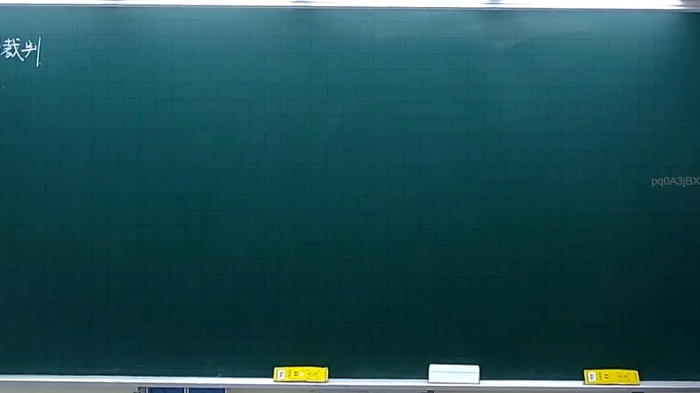
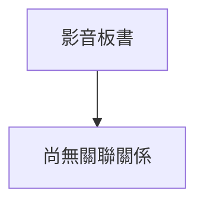

# 🎥 影音教材板書校對筆記
- **來源影片**: [預約 4 2025-10-06 18-23-34-061](file:///H:/憲法霖洄/ch4/預約 4 2025-10-06 18-23-34-061.mp4)
- **課程分類**: `預設課程`
- **課堂章節**: `ch4`
- **影片時間戳記**: `00:04:00` (240 秒)
- **板書類型**: `關係圖/邏輯圖板書`
- **偵測時間**: 2026-07-13 20:04:52

## 🔍 擷取黑板板書對照圖

## 🧠 AI 智慧理解與知識庫演化註記

目前，您尚未提供 OCR 文字的具体内容，因此無法立即進行語意整理與法律條文對比。請您將辨識出的板書文字提供給我，或者告訴我板書的主要內容和关键词（如：「原告甲」、「被告乙」、「權利A」、「債務B」等），我将根據這些信息進行分析並生成相應的知識庫比對與 Mermaid 程式碼。

## 📊 可編輯之 Mermaid 關係流程圖

## ✍️ 操作者手動校對修改區
<!-- 您可以直接修改上方的文字或調整 Mermaid 區塊中的節點，Obsidian 會即時重新渲染 -->
- [ ] 欄位結構與法律邏輯已校對無誤。
- **校對筆記**: 
