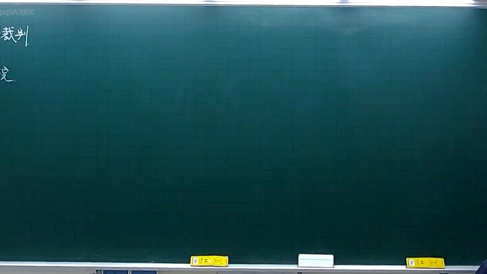
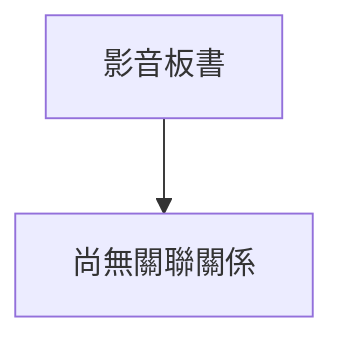

# 🎥 影音教材板書校對筆記
- **來源影片**: [預約 4 2025-10-06 18-23-34-061](file:///H:/憲法霖洄/ch4/預約 4 2025-10-06 18-23-34-061.mp4)
- **課程分類**: `預設課程`
- **課堂章節**: `ch4`
- **影片時間戳記**: `00:06:30` (390 秒)
- **板書類型**: `關係圖/邏輯圖板書`
- **偵測時間**: 2026-07-13 20:07:32

## 🔍 擷取黑板板書對照圖

## 🧠 AI 智慧理解與知識庫演化註記

目前無法進一步處理，因為缺乏具體的文字內容來進行語意整理與對比。請您提供OCR辨识后的文字内容，以便我能够完成以下事項：
1. 針對辨識出的板書文字，進行語意整理，並自動與臺灣現行法律條文（如民法第184條、侵權行為、消滅時效等）進行比對，寫下「知識庫比對與理解演化註記」。
2. 如果分類為「關係圖/邏輯圖板書」（或者有複雜邏輯關係），請幫我生成對應的 Mermaid.js 流程圖代碼以呈現老師黑板上的圖畫結構。

## 📊 可編輯之 Mermaid 關係流程圖

## ✍️ 操作者手動校對修改區
<!-- 您可以直接修改上方的文字或調整 Mermaid 區塊中的節點，Obsidian 會即時重新渲染 -->
- [ ] 欄位結構與法律邏輯已校對無誤。
- **校對筆記**: 
