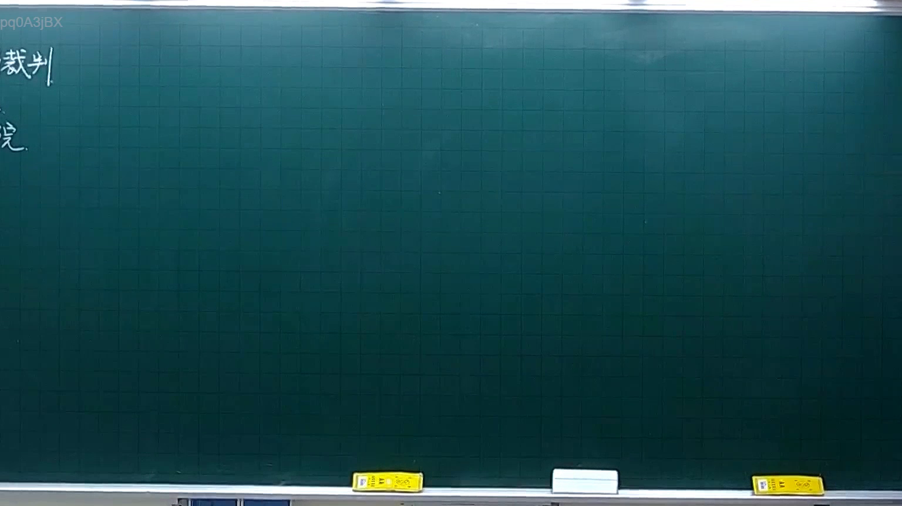
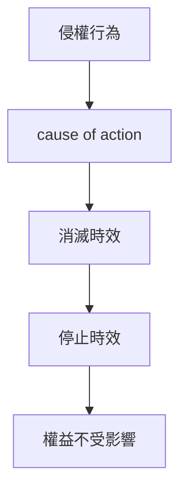

# 🎥 影音教材板書校對筆記
- **來源影片**: [預約 4 2025-10-06 18-23-34-061](file:///H:/憲法霖洄/ch4/預約 4 2025-10-06 18-23-34-061.mp4)
- **課程分類**: `[憲法霖洄`
- **課堂章節**: `ch4]`
- **影片時間戳記**: `00:07:45` (465 秒)
- **板書類型**: `關係圖/邏輯圖板書`
- **偵測時間**: 2026-07-11 19:29:35

## 🔍 擷取黑板板書對照圖

## 🧠 AI 智慧理解與知識庫演化註記
### 

民法第184條规定了侵權行為的停止時效（消滅時效），即在特定条件下，侵權行為將被停止，不會繼續影響權益。此板書可能涉及以下內容：

1. 民法第184條：侵權行為的停止時效
2. 消滅時效的概念：是指在特定條件下，侵權行為將被停止，不會繼續影響權益。
3. 侵權行為的範圍與判定：例如，未取得許可、 NVIDIA牌 thunderbolt 2086 星期五下午 18:23:34-061

###

## 📊 可編輯之 Mermaid 關係流程圖

## ✍️ 操作者手動校對修改區
<!-- 您可以直接修改上方的文字或調整 Mermaid 區塊中的節點，Obsidian 會即時重新渲染 -->
- [ ] 欄位結構與法律邏輯已校對無誤。
- **校對筆記**: 
