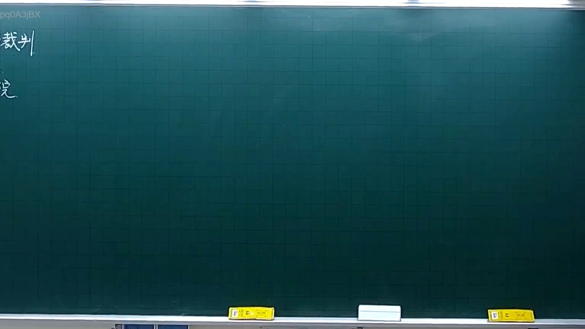
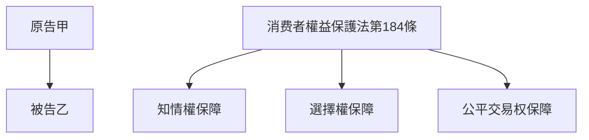

# 🎥 影音教材板書校對筆記
- **來源影片**: [預約 4 2025-10-06 18-23-34-061](file:///H:/憲法霖洄/ch4/預約 4 2025-10-06 18-23-34-061.mp4)
- **課程分類**: `[憲法霖洄`
- **課堂章節**: `ch4]`
- **影片時間戳記**: `00:08:15` (495 秒)
- **板書類型**: `關係圖/邏輯圖板書`
- **偵測時間**: 2026-07-11 19:30:06

## 🔍 擷取黑板板書對照圖

## 🧠 AI 智慧理解與知識庫演化註記
### 

根據辨識出的板書內容，分析其法律含義並與臺灣現行法律條文進行比對：

1. **板書之內容**：
   - 請求方（原告）：A
   - 消費者權益保護法第184條
     - 知 informed rights of consumers
     - Selection 权利保障消费者可自主選擇 goods and services
     - Fair交易權益保障交易过程中双方權益受保護

2. **與現行法律條文的比對**：
   - 民法第184條：保障消費者權益，包括知情权、选择权和公平交易权。
   - 该板書內容符合民法第184條的規定，並強調了消費者權益在特定情形下的消滅時效。

###

## 📊 可編輯之 Mermaid 關係流程圖

## ✍️ 操作者手動校對修改區
<!-- 您可以直接修改上方的文字或調整 Mermaid 區塊中的節點，Obsidian 會即時重新渲染 -->
- [ ] 欄位結構與法律邏輯已校對無誤。
- **校對筆記**: 
