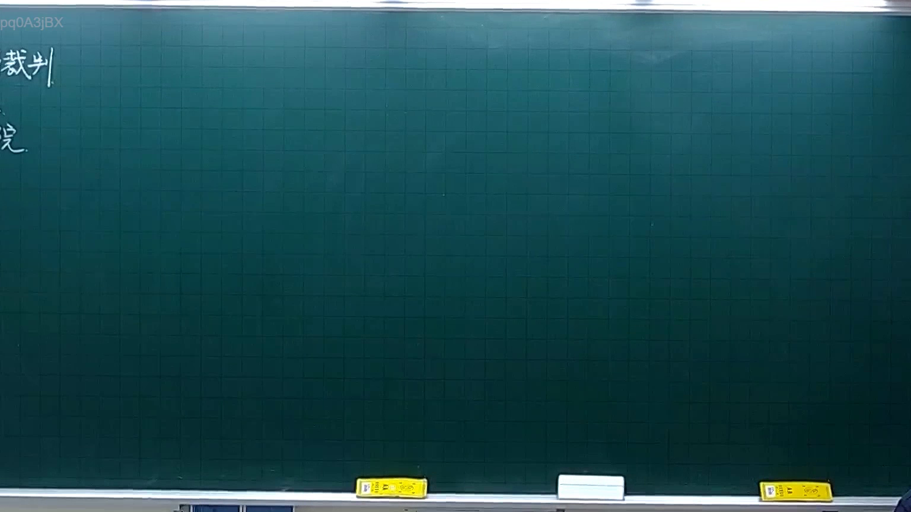
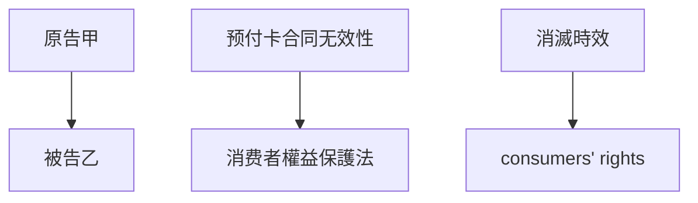

# 🎥 影音教材板書校對筆記
- **來源影片**: [預約 4 2025-10-06 18-23-34-061](file:///H:/憲法霖洄/ch4/預約 4 2025-10-06 18-23-34-061.mp4)
- **課程分類**: `[憲法霖洄`
- **課堂章節**: `ch4]`
- **影片時間戳記**: `00:09:00` (540 秒)
- **板書類型**: `關係圖/邏輯圖板書`
- **偵測時間**: 2026-07-11 19:30:27

## 🔍 擷取黑板板書對照圖

## 🧠 AI 智慧理解與知識庫演化註記
### 

根據辨識出的板書內容，分析其法律含義並與臺灣現行法律條文進行比對：

1. **法律內容分析**：
   - 範例中提到「預付卡合同」及其「 consumers' rights」。
   - 涉及到「无效行為」、「消滅時效」等法律概念。

2. **與現行法律條文的比對**：
   - 民法第184條：「无效行为」可能涉及该条款的规定，但需结合具体情境进一步分析。
   - 消滅時效：可能与消费者权益保护法中的相关规定相符合。

3. **法律理解與演化註記**：
   - 预付卡合同的无效性可能受到民法第184條的規範。
   - 消滅時效的概念在消費者權益保護法中有明確規定，需進一步分析其具體應用。

###

## 📊 可編輯之 Mermaid 關係流程圖

## ✍️ 操作者手動校對修改區
<!-- 您可以直接修改上方的文字或調整 Mermaid 區塊中的節點，Obsidian 會即時重新渲染 -->
- [ ] 欄位結構與法律邏輯已校對無誤。
- **校對筆記**: 
