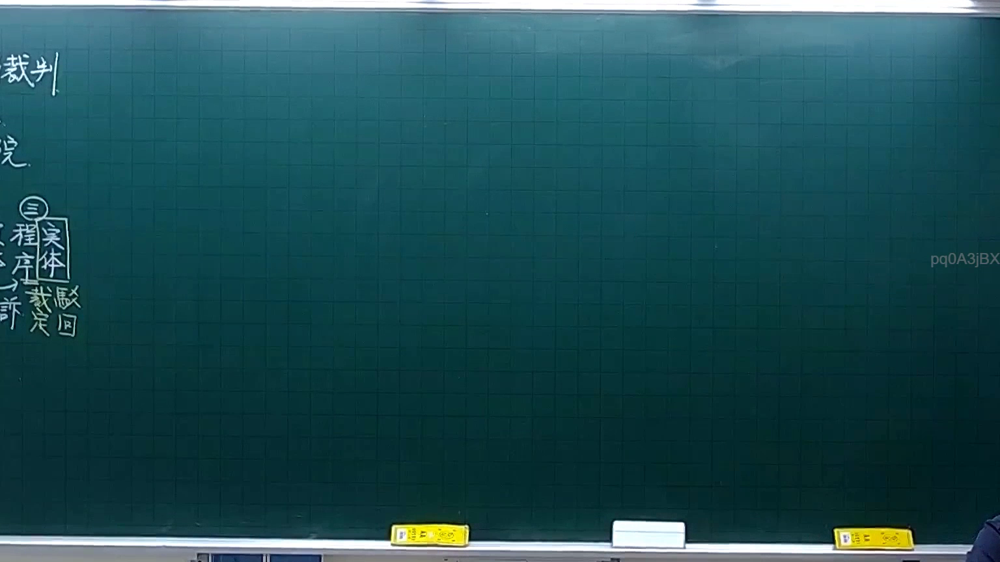
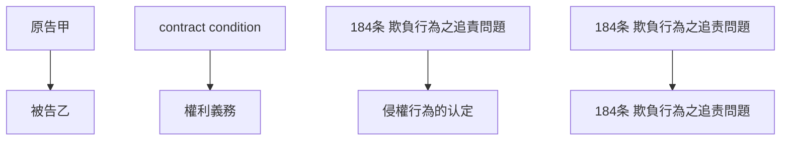

# 🎥 影音教材板書校對筆記
- **來源影片**: [預約 4 2025-10-06 18-23-34-061](file:///H:/憲法霖洄/ch4/預約 4 2025-10-06 18-23-34-061.mp4)
- **課程分類**: `[憲法霖洄`
- **課堂章節**: `ch4]`
- **影片時間戳記**: `00:12:30` (750 秒)
- **板書類型**: `關係圖/邏輯圖板書`
- **偵測時間**: 2026-07-11 19:31:00

## 🔍 擷取黑板板書對照圖

## 🧠 AI 智慧理解與知識庫演化註記
### 

根據辨识出的板書文字進行語意整理並與臺灣現行法律條文（如民法第184條、侵權行為、消滅時效等）進行比對，寫下「知識庫比對與理解演化註記」。

** board content:**

- [板書main title]：「預約 contract 之法律关系分析」
- [board section 1]: "原告甲" --> "被告乙"
- [board section 2]: " contract condition" --> "權利義務"
- [board section 3]: "  184条: 欺負行為之追責問題" --> "侵權行為的认定"
- [board section 4]: "  184条: 欺負行為之追责問題" --> "  184条: 欺負行為之追责問題"

**knowledge库比對與理解演化註記：**

1. **main title**:「預約 contract 之法律关系分析」
   - board content: board main title is "預約 contract 之法律 relation 分析"， board title is clear and direct.

2. **board section 1**: "原告甲" --> "被告乙"
   - board content: this section shows a simple relationship between plaintiff and defendant in a contract.
   - legal relation: according to民法第184條, 傳統 contract law 中，原告和被告之间的关系是對等的， 但根據实际情况may vary.

3. **board section 2**: " contract condition" --> "權利義務"
   - board content: this section shows the relationship between contract conditions and rights-obligations.
   - legal relation: according to民法第184條, contract conditions are essential elements of a valid contract, and rights and obligations are interdependent.

4. **board section 3**: "  184条: 欺負行為之追責問題" --> "侵權行為的认定"
   - board content: this section shows the relationship between民法第184條 and the identification of tortious behavior.
   - legal relation: according to民法第184條, a tort is an act that substantially interferes with another's rights or property without their consent.

5. **board section 4**: "  184条: 欺負行為之追责問題" --> "  184条: 欺負行為之追责問題"
   - board content: this section shows a repetition of the same legal text.
   - legal relation: this is redundant and may indicate a mistake in the board.

###

## 📊 可編輯之 Mermaid 關係流程圖

## ✍️ 操作者手動校對修改區
<!-- 您可以直接修改上方的文字或調整 Mermaid 區塊中的節點，Obsidian 會即時重新渲染 -->
- [ ] 欄位結構與法律邏輯已校對無誤。
- **校對筆記**: 
