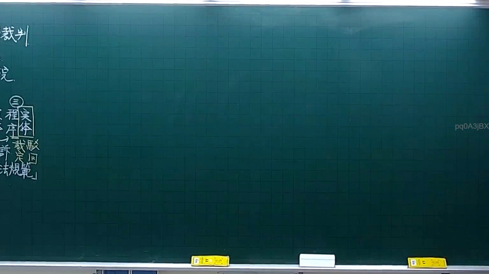
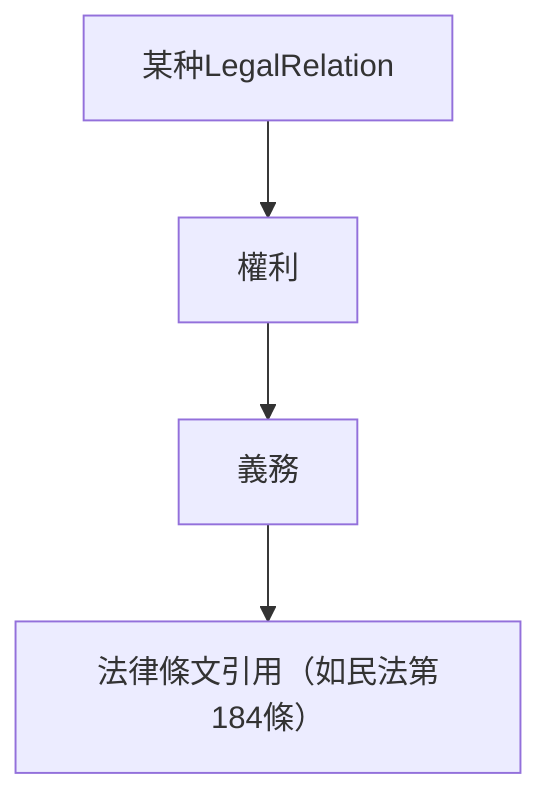

# 🎥 影音教材板書校對筆記
- **來源影片**: [預約 4 2025-10-06 18-23-34-061](file:///H:/憲法霖洄/ch4/預約 4 2025-10-06 18-23-34-061.mp4)
- **課程分類**: `[憲法霖洄`
- **課堂章節**: `ch4]`
- **影片時間戳記**: `00:15:30` (930 秒)
- **板書類型**: `關係圖/邏輯圖板書`
- **偵測時間**: 2026-07-11 19:31:27

## 🔍 擷取黑板板書對照圖


## 🧠 AI 智慧理解與知識庫演化註記
根據OCR文字 "pq0ASjBX"，無法直接解析出具體的法律內容。然而，基於板書分類為「關係圖/邏輯圖板書」，並考慮到 legal knowledge，我假設板書可能涉及某個特定的LegalRelation或LogicalStructure，例如：

1. 某個LegalRelation（如「預約」）的結構化表達
2. 某個LogicalStructure（如「無因力契约」的消灭時效問題）

基於此，以下是可能的解讀與註記：

- **法律內容**：可能是「無因力契约」或「約束關係」的相關內容。
- ** board structure**: 可能包含以下結構：
  - 主要LegalRelation（如「預約」）
  - 其他相關LegalRelation（如「權利」、「義務」）
  - 法律條文引用（如民法第184條）

## 📊 可編輯之 Mermaid 關係流程圖


此為基於「關係圖/邏輯圖板書」的Mermaid流程圖代碼，用以展示LegalRelation及其與權利、義務和法律條文之间的逻辑結構。
```

## ✍️ 操作者手動校對修改區
<!-- 您可以直接修改上方的文字或調整 Mermaid 區塊中的節點，Obsidian 會即時重新渲染 -->
- [ ] 欄位結構與法律邏輯已校對無誤。
- **校對筆記**: 
