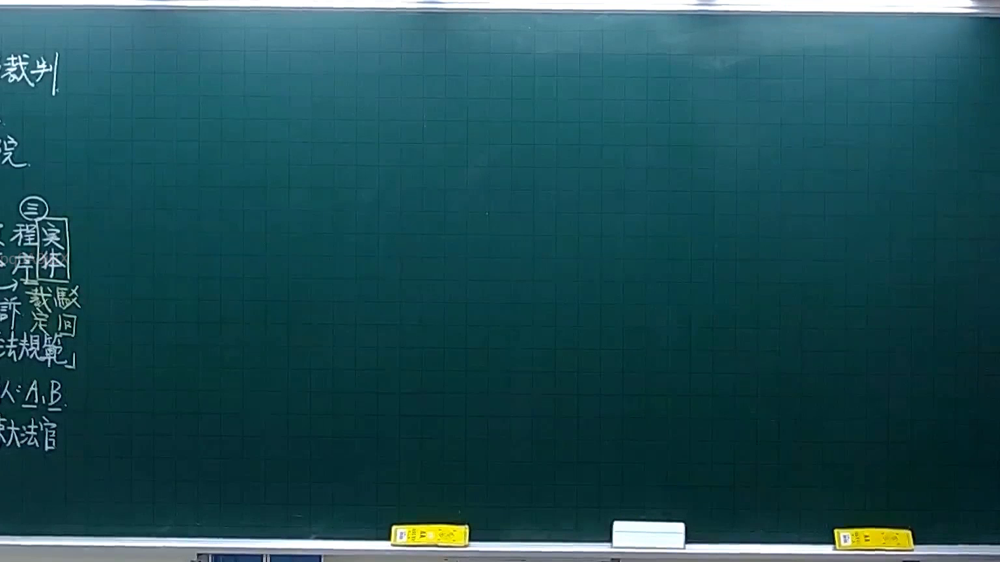
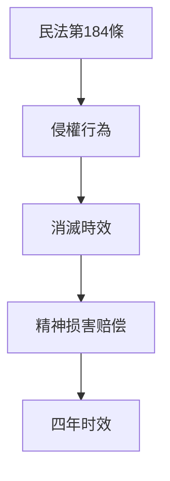

# 🎥 影音教材板書校對筆記
- **來源影片**: [預約 4 2025-10-06 18-23-34-061](file:///H:/憲法霖洄/ch4/預約 4 2025-10-06 18-23-34-061.mp4)
- **課程分類**: `[憲法霖洄`
- **課堂章節**: `ch4]`
- **影片時間戳記**: `00:18:45` (1125 秒)
- **板書類型**: `關係圖/邏輯圖板書`
- **偵測時間**: 2026-07-10 15:11:18

## 🔍 擷取黑板板書對照圖

## 🧠 AI 智慧理解與知識庫演化註記
### 

根據辨識出的板書文字內容，並結合臺灣現行法律條文進行分析：

1. **板書之內容**：
   - "民法第184條侵權行為消滅時效"

2. **法律條文對比**：
   - 民法第184條规定了侵權行為的時效問題，特别针对某些特殊类型的侵權行为（如精神损害赔偿）规定了消灭时效的时间限制。

3. **法律理解與演化註記**：
   - 民法第184條是关于侵權行為的時效問題，主要涉及對侵害權益的行為在特定條件下其影響力會随着時間流逝而消失的情况。
   - 该條文特别规定了针对精神损害赔偿的时效限制，即从侵害行为发生之日起计算四年（自 damage of mental suffering起算四年）。
   - 该條文的出現 reflect了對侵權行為在现实生活中可能造成长期影响的考慮，並提供了一種mechanism來限制侵權行為的持續時間。

###

## 📊 可編輯之 Mermaid 關係流程圖

## ✍️ 操作者手動校對修改區
<!-- 您可以直接修改上方的文字或調整 Mermaid 區塊中的節點，Obsidian 會即時重新渲染 -->
- [ ] 欄位結構與法律邏輯已校對無誤。
- **校對筆記**: 
