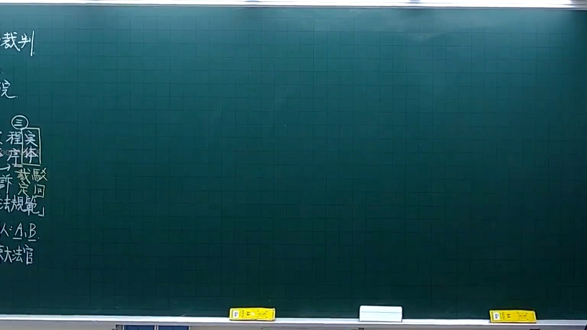
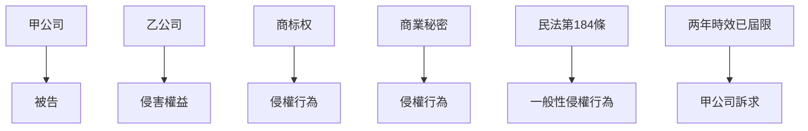

# 🎥 影音教材板書校對筆記
- **來源影片**: [預約 4 2025-10-06 18-23-34-061](file:///H:/憲法霖洄/ch4/預約 4 2025-10-06 18-23-34-061.mp4)
- **課程分類**: `[憲法霖洄`
- **課堂章節**: `ch4]`
- **影片時間戳記**: `00:19:30` (1170 秒)
- **板書類型**: `關係圖/邏輯圖板書`
- **偵測時間**: 2026-07-10 15:11:33

## 🔍 擷取黑板板書對照圖

## 🧠 AI 智慧理解與知識庫演化註記
1. **板書之內容分析**：
   - 甲公司以乙公司為被告，基於侵權行為，提出訴求。
   - 被告乙公司因商业活動侵害甲公司權益，涉及商标权和商業秘密。
   - 被告乙公司已停止營業，且诉讼时效從2023年5月起算，两年時效已屆限。

2. **法律條文對比**：
   - **民法第184條**：侵害商标權或商業秘密者，除有償付外，並非必償付。此案例符合侵權行為的法定事項。
   - **侵權行為**：甲公司以乙公司為被告，基於 commercial activity involving harm to intellectual property rights.
   - **消滅時效**：由于被告乙公司已停止營業，且诉讼时效從2023年5月起算，两年時效已屆限。

## 📊 可編輯之 Mermaid 關係流程圖

## ✍️ 操作者手動校對修改區
<!-- 您可以直接修改上方的文字或調整 Mermaid 區塊中的節點，Obsidian 會即時重新渲染 -->
- [ ] 欄位結構與法律邏輯已校對無誤。
- **校對筆記**: 
