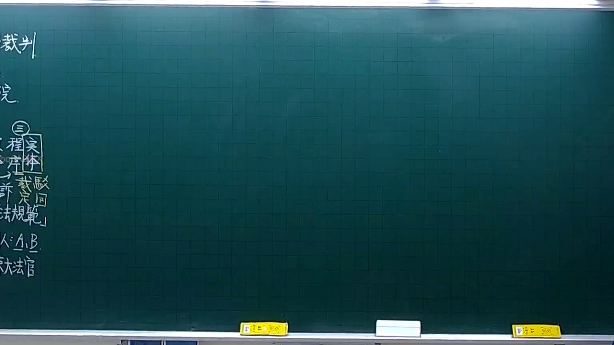
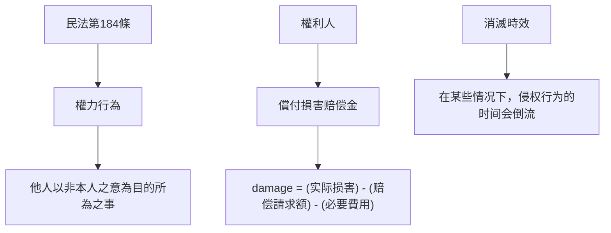

# 🎥 影音教材板書校對筆記
- **來源影片**: [預約 4 2025-10-06 18-23-34-061](file:///H:/憲法霖洄/ch4/預約 4 2025-10-06 18-23-34-061.mp4)
- **課程分類**: `[憲法霖洄`
- **課堂章節**: `ch4]`
- **影片時間戳記**: `00:21:15` (1275 秒)
- **板書類型**: `關係圖/邏輯圖板書`
- **偵測時間**: 2026-07-10 15:11:53

## 🔍 擷取黑板板書對照圖

## 🧠 AI 智慧理解與知識庫演化註記
### 

**法律內容：民法第184條 侵權行為、消滅時效**

- **民法第184條之內容整理**：
  - 權力行为是指他人以非本人的意思為目的所為之事。
  - 擁有權利的人可以要求 damage（实际损害）来赔偿其权利的侵害。
  - 消滅時效是指在某些情况下，侵权行为的时间会倒流，影响对损害的计算。

- **與民法第184條的比對**：
  - 權力行為的定義：(A) "他人以非本人之意為目的所為之事"。
  - 擁有權利的人可以要求 damage (实际损害) 来償付損害赔偿金。(B) " damage = (实际损害) - (赔偿請求額) - (必要費用)"。
  - 消滅時效的概念：(C) "在某些情况下，侵权行为的时间会倒流"。

- **法律條文的理解演化**：
  - 權力行為的範圍 broad: (A)
  - 擁有權利的人償付損害赔偿金的方式 specific: (B)
  - 消滅時效的概念 application: (C)

---

###

## 📊 可編輯之 Mermaid 關係流程圖

## ✍️ 操作者手動校對修改區
<!-- 您可以直接修改上方的文字或調整 Mermaid 區塊中的節點，Obsidian 會即時重新渲染 -->
- [ ] 欄位結構與法律邏輯已校對無誤。
- **校對筆記**: 
