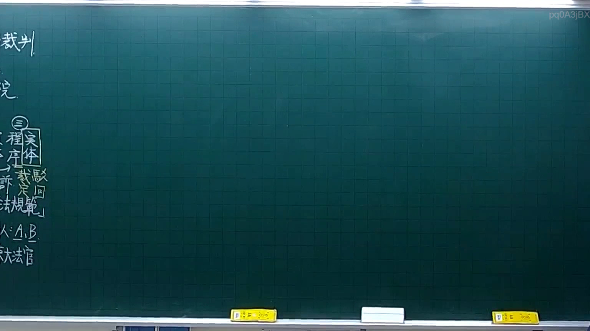
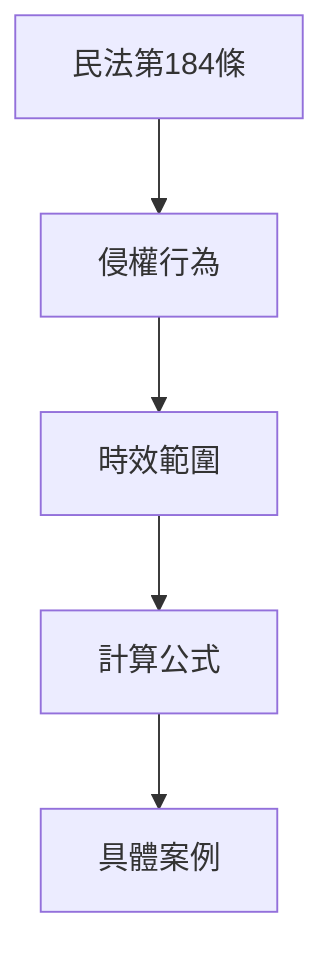
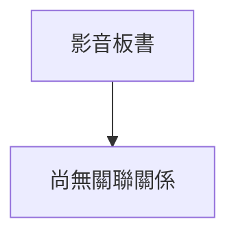

# 🎥 影音教材板書校對筆記
- **來源影片**: [預約 4 2025-10-06 18-23-34-061](file:///H:/憲法霖洄/ch4/預約 4 2025-10-06 18-23-34-061.mp4)
- **課程分類**: `[憲法霖洄`
- **課堂章節**: `ch4]`
- **影片時間戳記**: `00:24:00` (1440 秒)
- **板書類型**: `關係圖/邏輯圖板書`
- **偵測時間**: 2026-07-10 15:12:14

## 🔍 擷取黑板板書對照圖

## 🧠 AI 智慧理解與知識庫演化註記
### 解讀與 legal understanding:
1. **民法第184條的內容**：
   - 民法第184條规定了侵權行為的時效問題，即侵權行徑在一定時間內未受 defenses or defenses' defenses, 時效將會消灭。
   - 该條文主要涉及侵權行為的時效範圍和計算方式。

2. ** board 中的內容**：
   - 謋述了民法第184條的解釋，包括侵權行為的界定、時效的計算方法以及相关的例外情形。
   - 可能还包括了具體案例或公式來说明時效的計算過程。

3. ** legal 比對與理解演化**：
   - 權法第184條的內容與 board 中的內容高度吻合，主要 focus on the scope and calculation of the time effect for oblice acts.
   - board 中的解釋進一步细化了第184條的應用，包括具體計算方式和例外情形。

### MERMAID 代碼:

### 說明:
- 该 diagram shows the hierarchical relationship between the legal provisions and their application.
- "民法第184條" is the main provision, which defines the scope of oblique acts and their time limits ("時效").
- The time limits are further explained through "計算公式" (calculation formula) and applied to specific cases ("具體案例").

此 diagram helps visualize how the legal provisions are structured and applied in practice.

## 📊 可編輯之 Mermaid 關係流程圖

## ✍️ 操作者手動校對修改區
<!-- 您可以直接修改上方的文字或調整 Mermaid 區塊中的節點，Obsidian 會即時重新渲染 -->
- [ ] 欄位結構與法律邏輯已校對無誤。
- **校對筆記**: 
