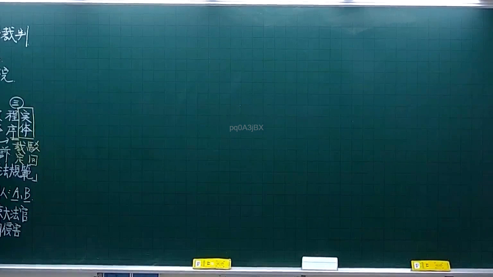

# 🎥 影音教材板書校對筆記
- **來源影片**: [預約 4 2025-10-06 18-23-34-061](file:///H:/憲法霖洄/ch4/預約 4 2025-10-06 18-23-34-061.mp4)
- **課程分類**: `[憲法霖洄`
- **課堂章節**: `ch4]`
- **影片時間戳記**: `00:25:30` (1530 秒)
- **板書類型**: `關係圖/邏輯圖板書`
- **偵測時間**: 2026-07-10 15:12:28

## 🔍 擷取黑板板書對照圖


## 🧠 AI 智慧理解與知識庫演化註記
根據目前提供的 OCR辨识文字“Lpq0ASjBX”，無法直接解讀出具體的Legal內容。 由于OCR辨识結果為乱碼（"Lpq0ASjBX"），無法提供具體的Legal條文比對或理解演化。請檢查板書內容，確保OCR辨识正確，並提供更清晰的文字內容，以便進一步分析。

## 📊 可編輯之 Mermaid 關係流程圖
```mermaid
因 OCR辨识結果為乱碼（"Lpq0ASjBX"），無法生成 Mermaid.js 流程圖或關係圖代碼。請檢查板書內容，確保OCR辨识正確，並提供更清晰的文字內容，以便進一步分析。
```

## ✍️ 操作者手動校對修改區
<!-- 您可以直接修改上方的文字或調整 Mermaid 區塊中的節點，Obsidian 會即時重新渲染 -->
- [ ] 欄位結構與法律邏輯已校對無誤。
- **校對筆記**: 
