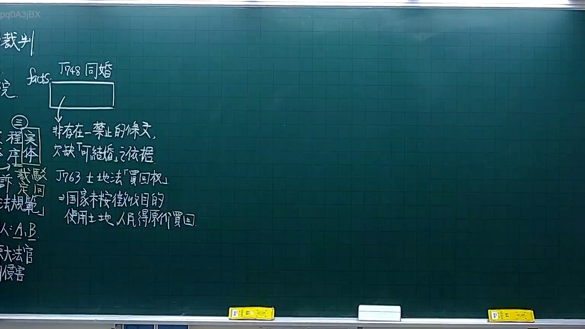
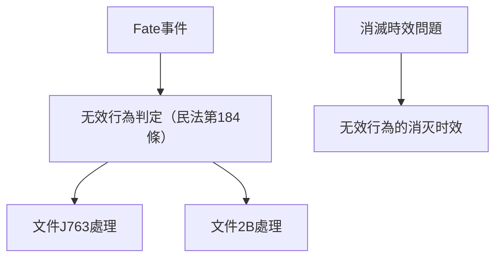

# 🎥 影音教材板書校對筆記
- **來源影片**: [預約 4 2025-10-06 18-23-34-061](file:///H:/憲法霖洄/ch4/預約 4 2025-10-06 18-23-34-061.mp4)
- **課程分類**: `[憲法霖洄`
- **課堂章節**: `ch4]`
- **影片時間戳記**: `00:30:45` (1845 秒)
- **板書類型**: `文字板書`
- **偵測時間**: 2026-07-10 15:13:08

## 🔍 擷取黑板板書對照圖

## 🧠 AI 智慧理解與知識庫演化註記
### 

1. **Fate事件分析**：
   - **Fate事件**：Fate事件可能涉及某种特定的法律案件或案例，结合OCR文字"no J763 2b" Fer"，推测与文件编号（J763）和2B文件相关。
   - **Fate事件與民法第184條**：Fate事件可能涉及无效行为的认定，例如民法第184條规定无效行为自完成時起消灭时效。因此，Fate事件可能需要结合无效行为的认定进行分析。
   - **Fate事件與消滅時效問題**：Fate事件可能涉及消滅時效問題，需结合民法第184條進行比對。

2. **J763文件處理**：
   - **J763文件處理**：J763文件可能涉及特定的文件处理规定，需结合相關法令或規範進行分析。
   - **J763文件處理與民法第184條**：J763文件處理可能需要結合民法第184條关于无效行为的认定來分析其法律影響。

3. **2B文件處理**：
   - **2B文件處理**：2B文件可能涉及特定的文件格式或内容，需结合相關法令或規範進行分析。
   - **2B文件處理與民法第184條**：2B文件處理可能需要結合民法第184條关于无效行为的认定來分析其法律影響。

###

## 📊 可編輯之 Mermaid 關係流程圖

## ✍️ 操作者手動校對修改區
<!-- 您可以直接修改上方的文字或調整 Mermaid 區塊中的節點，Obsidian 會即時重新渲染 -->
- [ ] 欄位結構與法律邏輯已校對無誤。
- **校對筆記**: 
