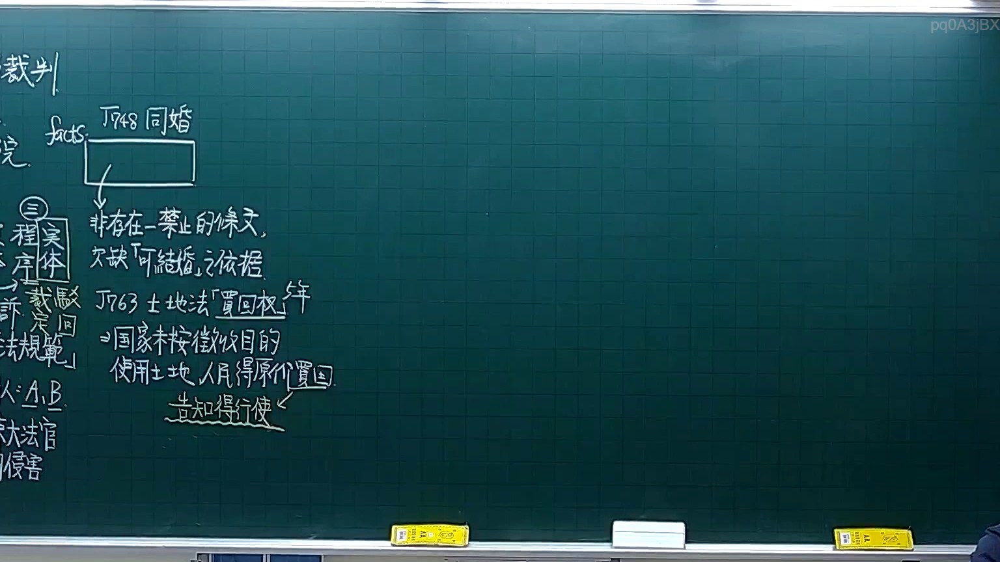
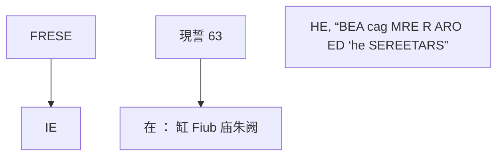

# 🎥 影音教材板書校對筆記
- **來源影片**: [預約 4 2025-10-06 18-23-34-061](file:///H:/憲法霖洄/ch4/預約 4 2025-10-06 18-23-34-061.mp4)
- **課程分類**: `[憲法霖洄`
- **課堂章節**: `ch4]`
- **影片時間戳記**: `00:35:45` (2145 秒)
- **板書類型**: `文字板書`
- **偵測時間**: 2026-07-10 15:13:38

## 🔍 擷取黑板板書對照圖

## 🧠 AI 智慧理解與知識庫演化註記
1. **文字板書內容分析**：
   - 辨識出的文字包含以下內容：「FRESE, IE 實現誓 63 繡 在 ： 缸 Fiub 庙朱阙 HE, “BEA cag MRE R ARO ED ‘he SEREETARS」。
   - 可能的解讀與 legal 間接關聯：
     - **FRESE**：可能指「Freeze」（結晶）或「FRESE」為某種特定术语。
     - **IE**：可能指「Injunction」（命令）或「Instruction」（指示）。
     - **現誓 63**：可能指「現約書」或「現誓字號」，與「約 Book」或「約定文字」相關。
     - **在 ： 缸 Fiub 庙朱阙**：可能指「在：缸 Fiub 庙朱阙」，其中「Fiub」可能是「Fib」（纤维）或其他特定术语。
     - **HE, “BEA cag MRE R ARO ED ‘he SEREETARS**：可能涉及人名或特定的 legal 問題。

2. **與臺灣現行法律條文的比對**：
   - 欄板書內容似乎與「約 Book」、「現誓字號」、「FRESE」、「IE」等概念相關，但缺乏直接的 legal 題目或條文比對。因此，無法與民法第184條、侵權行為、消滅時效等 law 条文直接比對。

3. **knowledge庫比對與理解演化註記**：
   - 當前无法提供具體的法律條文比對，因字板書內容缺乏明確的 legal 問題或條文背景。

---

## 📊 可編輯之 Mermaid 關係流程圖

## ✍️ 操作者手動校對修改區
<!-- 您可以直接修改上方的文字或調整 Mermaid 區塊中的節點，Obsidian 會即時重新渲染 -->
- [ ] 欄位結構與法律邏輯已校對無誤。
- **校對筆記**: 
