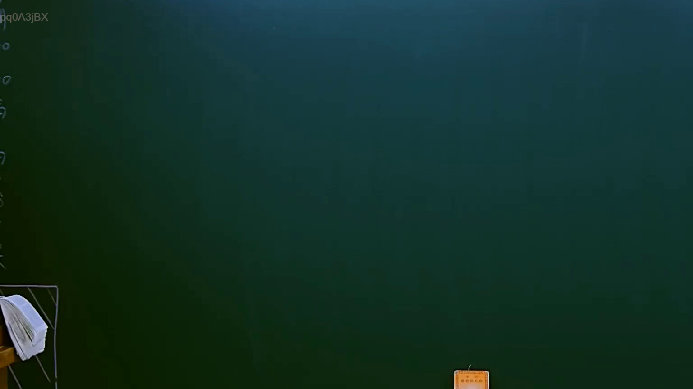
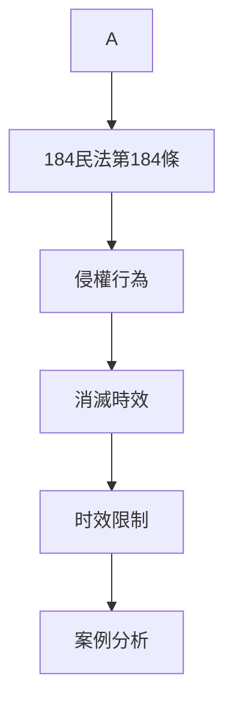

# 🎥 影音教材板書校對筆記
- **來源影片**: [預約 5 2025-04-11 14-54-37-485](file:///J://民法B/ch5/預約 5 2025-04-11 14-54-37-485.mp4)
- **課程分類**: `[民法B`
- **課堂章節**: `ch5]`
- **影片時間戳記**: `00:01:30` (90 秒)
- **板書類型**: `關係圖/邏輯圖板書`
- **偵測時間**: 2026-07-12 19:14:39

## 🔍 擷取黑板板書對照圖

## 🧠 AI 智慧理解與知識庫演化註記
### 

**A 184民法第184條侵權行為消滅時效**

- **A**: 指某種法律概念或实体（需根據上下文進一步分析）
- **184民法第184條**: 台灣地區现行法律中关于“侵權行為消滅時效”的规定，通常涉及侵權行為在一定期限内自动消失的情况。
- **消滅時效**: 指侵權行為在特定时间内自动消灭的时效问题。

此部分可能涉及对民法第184條的具体应用，包括侵權行為的范围、消灭时效的时间限制等。需结合具体案例分析其实际适用性。

###

## 📊 可編輯之 Mermaid 關係流程圖

## ✍️ 操作者手動校對修改區
<!-- 您可以直接修改上方的文字或調整 Mermaid 區塊中的節點，Obsidian 會即時重新渲染 -->
- [ ] 欄位結構與法律邏輯已校對無誤。
- **校對筆記**: 
