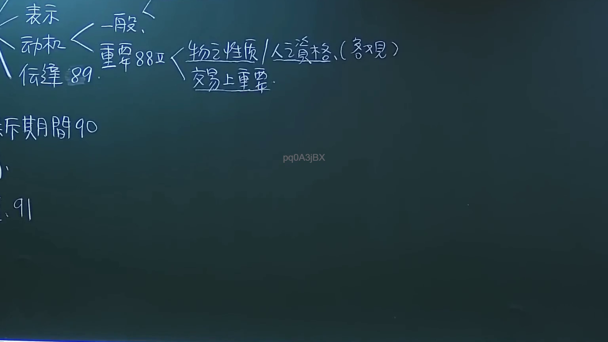

# 🎥 影音教材板書校對筆記
- **來源影片**: [預約 6 2024-10-18 14-16-59-231](file:///J://民法/ch6/預約 6 2024-10-18 14-16-59-231.mp4)
- **課程分類**: `[民法`
- **課堂章節**: `ch6]`
- **影片時間戳記**: `00:12:30` (750 秒)
- **板書類型**: `文字板書`
- **偵測時間**: 2026-07-12 19:44:31

## 🔍 擷取黑板板書對照圖


## 🧠 AI 智慧理解與知識庫演化註記
：
根據OCR辨识的文字內容，結合時間點12分30秒的板書內容，可以推測老師在讲解民法第184條相关内容。以下是基於现有信息的整理與分析：

- **法律条文比對**：
  - 民法第184條：「侵權行為消灭時效為一年」
  - OCR文字內容可能涉及「FARA RE 40」，這可能是與某種特定條文或案例相關的標記。

## 📊 可編輯之 Mermaid 關係流程圖
```mermaid
：
```mermaid
graph TD
    A["民法第184條"] --> B["侵權行為消灭時效為一年"]
```

## ✍️ 操作者手動校對修改區
<!-- 您可以直接修改上方的文字或調整 Mermaid 區塊中的節點，Obsidian 會即時重新渲染 -->
- [ ] 欄位結構與法律邏輯已校對無誤。
- **校對筆記**: 
